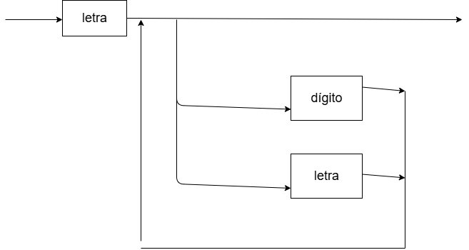

# Conceptos y Paradigmas de Lenguajes de Programación  2026 
# Práctica Nro 1 - Historia, evolución y características de Leng. de Programación 

### Objetivo:  conocer como se define léxicamente un lenguaje de programación y cuales son las herramientas necesarias para hacerlo 

### Ejercicio 1: Complete el siguiente cuadro: 

| BNF | EBNF | Diagramas Sintácticos | Significado |
| :--- | :---: | :---: | :---: |
| palabra terminal | palabra terminal |   | **Definición de elemento terminal** |
| `<>` | `<>` | rectángulo | **Definición de  un elemento NO terminal** |
| `::=` |  `::=` | diagrama con rectángulos, óvalos y flechas | **Es un metasímbolo de como lo que está a la izquierda se define con lo de la derecha**|
| `/` | `(/)` (en ambas es recta pero MD no me deja) | flecha que se divide en dos o más caminos | **Indicador de un OR** |  
| `< p > < p1 > ` |  `{}` |  bucle, flecha de retorno   | **Repetición** |
|Usa recursión | `{}` |rectángulo del bucle como opción después|**Repetición de 0 o más veces** | 
|Usa recursión | `{}+` | flecha de retorno después del rectángulo del bucle| **Repetición de 1 o más veces**|
|Usa recursión | `[]` | rectángulo del bucle como opción antes| **Repetición opcional**|

### Ejercicio 2: ¿Cuál es la importancia de la sintaxis para un lenguaje? ¿Cuáles son sus elementos? 

> La ***sintaxis*** es vital porque establece las reglas formales para componer caracteres y formar programas válidos. Sus elementos principales incluyen el alfabeto, identificadores, operadores, palabras reservadas y comentarios

### Ejercicio 3: ¿Explique a qué se denomina regla lexicográfica y regla sintáctica? 

> Las ***reglas léxicas*** definen cómo se forman las palabras (tokens) a partir de caracteres (ej. cómo se escribe un número), mientras que las ***reglas sintácticas*** definen cómo se combinan esas palabras para formar sentencias (ej. la estructura de un if).

### Ejercicio 4:¿En la definición de un lenguaje, a qué se llama palabra reservadas? ¿A qué son equivalentes en la definición de una gramática? De un ejemplo de palabra reservada en el lenguaje que más conoce. (Ada,C,Ruby,Python,..)

> Una palabra reservada es una palabra clave que el programador no puede usar como identificador. En una gramática, equivalen a símbolos terminales. Ejemplos:  en C,  en Pascal,  en Python: `if` `begin` `def`.

### Ejercicio 5: Dada la siguiente gramática escrita en BNF:

### G= ( N, T, S, P) 
### N = {<numero_entero>, <digito> } 
### T = {0, 1, 2, 3, 4, 5, 6, 7, 8, 9} 
### S = <numero_entero> 
### P = { 
### <numero_entero>::=<digito><numero_entero> | <numero_entero><digito> | 
### <digito> 
### <digito> ::= 0 | 1 | 2 | 3 | 4 | 5 | 6 | 7 | 8 | 9 
### } 
### a - Identifique las componentes de la misma 

> - ***N (Símbolos No Terminales):*** Son las "categorías" o "variables" de la gramática. No aparecen en el resultado final del programa; solo sirven para estructurar las reglas.En BNF se escriben entre ángulos: `<sentencia>`, `<variable>`, `<digito>`.En EBNF se suelen escribir en minúsculas: expresion, termino.
> - ***T (Símbolos Terminales):*** Son los elementos básicos y finales del lenguaje. Es el "alfabeto" real que el programador escribe en el código.Ejemplos: palabras reservadas (if, while), operadores (+, -), números (0, 1, 2) o signos de puntuación (;, {).Se llaman "terminales" porque una vez que llegas a ellos en una derivación, no puedes reemplazarlos por nada más.
> - ***S (Símbolo Inicial)***: Es un elemento especial que pertenece a $N$ ($S \in N$). Es el "punto de partida" de cualquier derivación. Toda estructura que quieras validar (por ejemplo, un programa completo o una expresión matemática) debe empezar a derivarse desde S.
> - ***P (Reglas de Producción):*** Es el conjunto de reglas que indican cómo se pueden transformar los símbolos. 

### b - Indique porqué es ambigua y corríjala 

> Es ambigua porque en la expresión: `<numero_entero>::=<digito><numero_entero> | <numero_entero><digito> | <digito>`, un número entero puede derivarse en **dígito y número entero** y también en **número entero y dígito** a la vez, y esto no puede suceder, una misma sentencia no puede tener dos formas distintas de derivarse.
> - Ejemplo: el ***110*** se podría dividir en **1 y 10** o también en **11 y 0**, formando dos árboles distintos.

### Ejercicio 6: Defina en BNF (Gramática de contexto libre desarrollada por Backus- Naur) la gramática para la definición de una palabra cualquiera.

> - ***G = {N,T,S,P}***
> - ***N = {<palabra>, <mayúscula>, <minúscula>}***
> - ***T = {A,a,B,b,C,c,D,d,E,e...,X,x,Y,y,Z,z}***
> - ***S = {<palabra>}***
> - ***P {***
> -       <palabra> ::= <minúscula><palabra> | <mayúscula><palabra> | <minúscula> | <mayúscula>
> -       <mayúscula> ::= A|B|C|D|E|F|G|H...
> -       <minúscula> ::= a|b|c|d|e|f|g|h...
> ***}***

### Ejercicio 7: Defina en EBNF la gramática para la definición de números reales. Inténtelo desarrollar para BNF y explique las diferencias con la utilización de la gramática EBNF.

### EBNF

> - ***G = {N,T,S,P}***
> - ***N = {<numero_real>, <dígito>,}***
> - ***T = {0,1,2,3,4,5,6,7,8,9,"+","-",","}***
> - ***S = {<número_real>}***
> -  ***P {***
>        <número_real> ::= [(+|-)]{<dígito>} + [,{<dígito>}+]
>        <dígito> ::= 0|1|2|3|4|5|6|7|8|9

> - ***}***

### BNF

> - ***G = {N,T,S,P}***
> - ***N = {<numero_real>, <entero_sig>, <dígito>,<decimal>, <entero>}***
> - ***T = {0,1,2,3,4,5,6,7,8,9,"+","-",","}***
> - ***S = {<número_real>}***
> -  ***P {***
>        <número_real> ::= <entero_sig> | <entero_sig><decimal>
> -      <decimal> ::= ,<entero>
> -      <entero_sig> ::= +<entero> | -<entero> | <entero>
> -      <entero> ::= <dígito> | <dígito><entero>
>        <dígito> ::= 0|1|2|3|4|5|6|7|8|9

> - ***}***

> La diferencia es que el EBNF es muchísimo más legible

### Ejercicio 8: Utilizando la gramática que desarrolló en los puntos 6 y 7, escriba el árbol sintáctico de: 
### a. Conceptos
               <palabra>
            /              \ 
        <mayúscula>        <palabra>
           |            /            \ 
           C       <minúscula>      <palabra>
                        |         /           \
                        o     <minúscula>    <palabra>
                                  |           /       \ 
                                  n     <minúscula>   <palabra>
                                            |         /        \
                                            c   <minúscula>     <palabra>
                                                    |            /     \ 
                                                    e      <minúscula> <palabra>
                                                                |        /   \
                                                                p           ...
### b. Programación 
               <palabra>
            /              \ 
        <mayúscula>        <palabra>
           |            /            \ 
           P       <minúscula>      <palabra>
                        |         /           \
                        r     <minúscula>    <palabra>
                                  |           /       \ 
                                  o     <minúscula>   <palabra>
                                            |         /        \
                                            g   <minúscula>     <palabra>
                                                    |            /     \ 
                                                    r     <minúscula> <palabra>
                                                                |        /   \
                                                                a         ...
### c. 1255869
               <entero>
            /           \
         <dígito>     <entero>
            |         /        \
            1     <dígito>     <entero>
                     |        /        \
                     2   <dígito>      <entero>
                            |          /       \ 
                            5    <dígito>       <entero>
                                    |         /         \
                                    5     <dígito>      <entero>
                                              |        /        \
                                              8    <dígito>     <entero>
                                                      |            /   
                                                      6        <dígito>     
                                                                   |
                                                                   9     
### d. 854,26
              <número_real>
            /           \
         <entero_sig>  <decimal>
            |          /        \
         <entero>     ,           <entero>
         /        \                /      \
    <dígito>     <entero>      <dígito>   <entero>
       |       /         \         |     /       
       8   <dígito>     <entero>   2   <dígito>             
              |         /                  |
              5    <dígito>                6
                       |           
                       4
### e. Conceptos de lenguajes

> No se puede realizar con la gramática realizada, ya que no cuenta con los caracteres de " ".

### Ejercicio 9: Defina utilizando diagramas sintácticos la gramática para la definición de un identificador de un lenguaje de programación. Tenga presente como regla que un identificador no puede comenzar con números.

                 

### Ejercicio 10:  

### a) Defina con EBNF la gramática para una expresión numérica, dónde intervienen variables y números. Considerar los operadores +, -, * y / sin orden de prioridad. No considerar el uso de paréntesis. 
### EBNF

> - ***G = {N,T,S,P}***
> - ***N = {<expr>,<variable>,<operador>,<número>,<dígito>,<letra>}***
> - ***T = {0,1,2,3,4,5,6,7,8,9,a,b,c,d,e..."+","-","x", "/"}***
> - ***S = <expr>*** 
> -  ***P {***
> -       <expr> ::= (<número> | <variable>){<operador>(<variable> | <número>)}+
> -       <número> ::= [(+|-)]{<dígito>}+
> -       <variable> ::= <letra> | <dígito><letra>
> -      <dígito> ::= 0|1|2|3|4|5|6|7|8|9
> -      <letra> ::= a|b|c|d|e|f|g|h...
> -      <operador> ::= (+|-|*|/)
> - ***}***

### b) A la gramática definida en el ejercicio anterior agregarle prioridad de operadores.

// preguntar

### c) Describa con sus palabras los pasos y decisiones que tomó para agregarle prioridad de  operadores al ejercicio anterior. 

### Ejercicio 11: La siguiente gramática intenta describir sintácticamente la sentencia for de ADA, indique cuál/cuáles son los errores justificando la respuesta.

> - **N=** {< sentencia_for >,  < bloque >, < variable >, < letra >, < cadena > < digito >, < otro >, < operacio n>, < llamada_a_funcion >, < numero >,  < sentencia > } 
> - **P=** { < sentencia_for >::= for (i= IN 1..10) loop < bloque > end loop; 
> - < variable> ::= < letra > | < cadena > 
> - < cadena >::= { ( < letra > | < digito > | < otro > ) }+ 
> - < letra >::=( a | .. | z | A | .. | Z ) 
> - < digito >::= ( 1 | 2 | 3 | 4 | 5 | 6 | 7 | 8 | 9 | 0 ) 
> - < bloque >::=  < sentencia > | < sentencia > < bloque > | < bloque > < sentencia > ;  
> - < sentencia >::= < sentencia_asignacion > | < llamada_a_funcion > |< sentencia_if > | < sentencia_for > |  < sentencia_while > | < sentencia_switch > } 

> - Le faltan los componentes de la tupla S y T
> - < sentencia_asignacion >, < llamada_a_funcion > , < sentencia_ if >, < sentencia_for >, < sentencia_while > y < sentencia_switch > están declarados como No Terminales y nunca se definen.
> - Es ambigua porque en la línea `<bloque> ::= <sentencia> | <sentencia><bloque> | <bloque><sentencia>` da la posibilidad de que se derive de dos manera diferents.
> - `<otro>` no está definido en P.
> - `<sentencia_if>`, `<sentencia_for>`, `<sentencia_swtich>`, no están ni en N.

### Ejercicio 12: Realice en EBNF la gramática para la definición un tag div en html 5. (Puede  ayudarse con el siguiente enlace (https://developer.mozilla.org/es/docs/Web/HTML/Elemento/div)

> - ***G = {N,T,S,P}***
> - ***N = {div, class, texto, atributos, contenido, caracter,style}***
> - ***T = {$\{ "
", "
", "style=", "class ="  "=", ' " ', "/", "a" ... "z", "A" ... "Z", "0" ..."9", " ", "-", "_", "." \}$}***
> - ***S = div*** 
> -  ***P {***
> -       div ::= "<div" [ atributos ] ">" contenido "
"
> -       atributos = { " " ( class | style ) }
> -       style ::= 'style="' texto '"'
> -      class ::=  'class="' texto '"'
> -      contenido ::= { texto | div }
> -      texto ::= caracter { caracter }
> -      caracter ::= "=", ' " ', "/", "a" ... "z", "A" ... "Z", "0" ..."9", " ", "-", "_", "."
> - ***}***

### Ejercicio 13: Defina en EBNF una gramática para la construcción de números primos.¿Qué debería agregar a la gramática para completar el ejercicio?

> La gramática para este ejercicio no sería suficiente porque habría que agregarle la parte ***semántica*** para la regla de qué números son primos.

### Ejercicio 14: Sobre un lenguaje de su preferencia escriba en EBNF la gramática para la definición de funciones o métodos o procedimientos (considere los parámetros en caso de ser necesario)
> ***Lenguaje: **Pascal*****
> - ***G = {N,T,S,P}***
> - ***N = {`<función>`, `<id>`, `<parámetro>`, `<tipo>`, `<instrucción>`,`<integer>`, `<string>`, `<char>`,`<real>`, `<boolean>`, `<asig>`, `<while>`, `<for>`, `<llamado_a_módulo>`, `<if>`}***
> - ***T = {$\{ function, (, ),  var, begin, end;, integer, string, boolean, char,real, ;, "=", ' " ', "/", "a" ... "z", "A" ... "Z", "0" ..."9", " ", "-", "_", "." \}$}***
> - ***S = {función}*** 
> -  ***P {***
> -       <función> ::= "function" <id> "(" { ["var"] <parámetro> ":" <tipo> [; ["var"] <parámetro> ":" <tipo>] }* ")" ":" <tipo> ";"
> -      "begin" {instrucción}+ "end;"
> -      parámetro ::= texto
> -      nombre ::= texto
> -      tipo ::= (<integer> | <string> | <char> | <boolean> | <real>) 
> -      instrucción ::= <asig> | <while> | <for> | <llamado_a_módulo> | <if>
> -      texto ::= <caracter> { <caracter> }*
> -      caracter ::= ("="| ' " '| "/"| "a" ... "z"| "A" ... "Z"| "0" ..."9"|  ", "| "-"| "_"| ".")
> - ***}***
> - [nota] Los "No Terminales" como los tipos de dato o tipos de instrucción no hace falta definirlos, pero habría que preguntarlo.