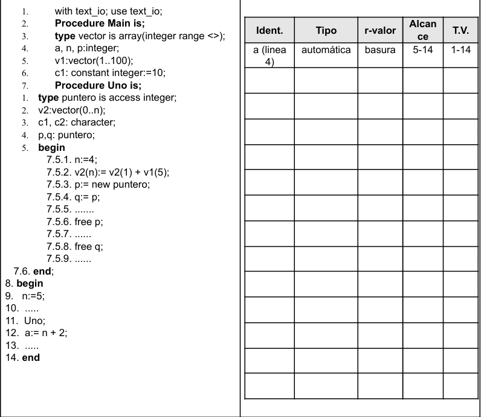
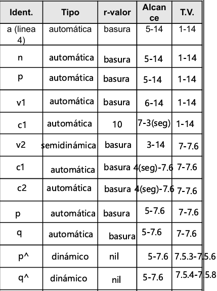
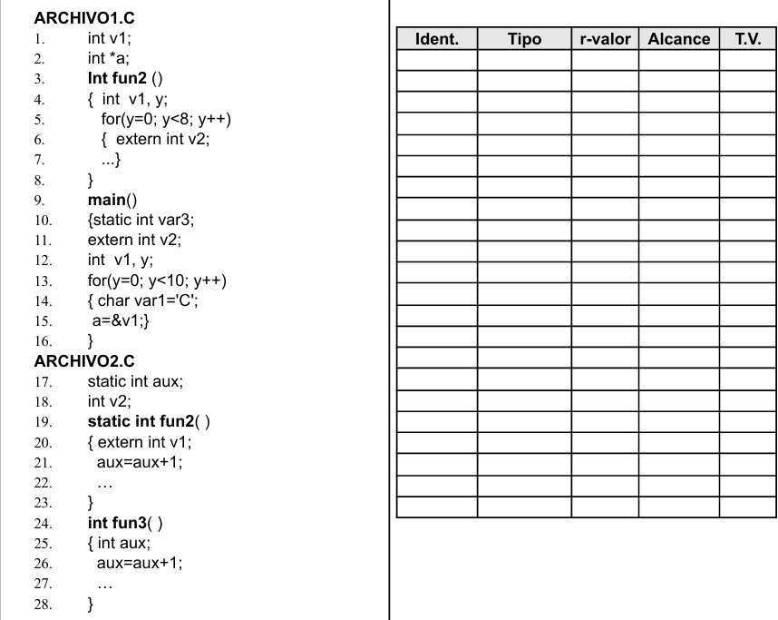
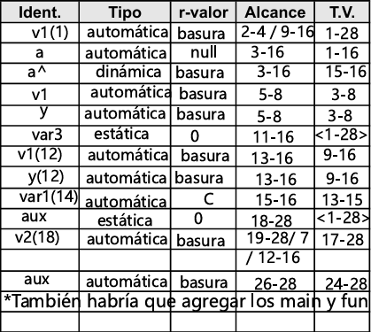

# Conceptos y Paradigmas de Lenguajes de Programación  2026 
# Práctica Nro 4 - Variables 

### Objetivo:  Conocer el manejo de identificadores en memoria y como lo definen e implementan los diferentes lenguajes.  

### Ejercicio 1: a) Tome una de las variables de la línea 3 del siguiente código e indique y defina cuales son sus atributos: 
    1. Procedure Practica4(); 
    2. var 
    3. a,i:integer 
    4. p:puntero 
    5. Begin 
    6. a:=0; 
    7. new(p); 
    8. p:= ^i 
    9. for i:=1 to 9 do 
    10. a:=a+i; 
    11. end; 
    12. ... 
    13. p:= ^a; 
    14. ... 
    15. dispose(p); 
    16. end; 

> Variable: `a`
> - ***Nombre:*** a
> - ***Alcance***: En el proceso Practica4().
> - ***Tipo:*** integer
> - ***L-valor:*** Automático
> - ***R-valor:*** Es indefinido

### b) Compare los atributos de la variable del punto a) con los atributos de la variable de la línea 4. Que dato contiene esta variable?,  

> Variable: `p`
> - ***Nombre:*** p
> - ***Alcance***: En el proceso Practica4().
> - ***Tipo:*** puntero
> - ***L-valor:*** `p` es automático y `p^` es dinámico
> - ***R-valor:*** `p` es *nil* y `p^` es *indefinido*

### Ejercicio 2:  
### a. Indique cuales son las diferentes formas de inicializar una variable en el momento de la declaración de la misma.

> - ***Inicialización explícita en la declaración:*** El programador especifica el valor inicial mediante una sentencia de asignación combinada con la declaración (ej. int i = 0;). Esta es una ligadura de valor realizada de forma manual por el usuario.
> - ***Inicialización por defecto (implícita):*** El lenguaje o su implementación asignan automáticamente un valor predefinido según el tipo de dato. Por ejemplo, los enteros se inicializan en 0, los caracteres en blanco o punteros en null.
> - ***Estrategia de "Ignorar el problema":*** El lenguaje no realiza ninguna acción y la variable toma como valor inicial lo que se encuentre en ese momento en la celda de memoria asignada (cadena de bits previa). Esto suele denominarse "valor basura" y puede conducir a errores lógicos si no se controla.

### b. Analice en los lenguajes: Java, C, Phyton y Ruby las diferentes formas de inicialización de variables que poseen. Realice un cuadro comparativo de esta característica. 

| **Lenguaje** | ***¿Requiere Declaración*** | ***Inicialización Explícita***| ***Inicialización por defecto***| ***¿Puede contener basura?***| 
| :--- | :---: | :---: | :---: | :---: | 
| **C** | Si | Permitida | Solo en globales | Si (en locales) |
| **Java** | Si |Permitida | Si (en atributos/campos) | No, lo evita el compilador |
| **Python**|  No | Si, al crear la variable |  No asigna | No |
| **Ruby**| No | Al crear la variable | Se usa `nil` para atributos | No |

### Ejercicio 3: Explique los siguientes conceptos asociados al atributo l-valor de una: 
#### a. Variable estática.
> Son variables que tienen su lugar en la memoria desde que arranca el programa hasta que se apaga. No importa si la función donde están termina, ellas siguen ahí. Pueden ser variables globales o las que tienen la palabra `static`.

### b. Variable automática o semiestática. 
> Son las variables locales comunes. Viven en el Stack. Su tiempo de vida está atado a la unidad (función/procedimiento) que las contiene. Pueden ser variables declaradas dentro de un `procedure` o `function`.

### c. Variable dinámica. 
> No tienen nombre propio, se accede a ellas a través de punteros. Se crean en el Heap. Son las que aparecen con nombres como como new(p), malloc() o dispose(p).

### d. Variable semidinámica. 
> Son un caso especial donde el espacio se reserva al entrar a la función, pero el tamaño depende de un parámetro.  Ejemplo: Un arreglo `A: array[1..n]` donde n es un parámetro que llega a la función.

De al menos un ejemplo de cada uno. 
    Investigue sobre que tipos de variables respecto de su l-valor hay en los lenguajes C y  Ada. 

### Ejercicio 4:

### a. ¿A qué se denomina variable local y a qué se denomina variable global? 
> Una ***Variable Local*** es aquella que es propia de una Unidad, ya se un subprograma, función o procedimiento y solo tiene alcance en ese bloque. Las ***Variables Globales*** son creadas en el Programa Principal o de forma externa a cualquier unidad. Su alcance llega a todo el programa o archivo.

### b. ¿Una variable local puede ser estática respecto de su l-valor? En caso afirmativo dé un ejemplo 
> Sí, una variable local puede tener un l-valor estático. Esto significa que, aunque su nombre solo sea visible dentro de una función (alcance local), su ubicación de memoria se reserva al momento de la compilación/carga y perdura durante toda la ejecución del programa (tiempo de vida global). 

### c. Una variable global ¿siempre es estática? Justifique la respuesta.
> No, una variable global puede no ser estática. El alcance de una variable no condicionan el momento en el que se alocan en memoria .

### d. Indique qué diferencia hay entre una variable estática respecto de su l-valor y una constante 

>  La diferencia fundamental radica en la estabilidad de su ***r-valor***. En la *variable estática*, su r-valor puede ser modificado mediante sentencias de asignación durante la ejecución, en cambio, una *constante* es una entidad cuyo r-valor es fijo y no puede cambiar una vez que se ha establecido la ligadura.

### Ejercicio 5:  

### a. En Ada hay dos tipos de constantes, las numéricas y las comunes. Indique a que se debe dicha clasificación.  

> - **Constantes Numéricas:** son aquellas que se declaran sin especificar un tipo de dato (solo con el valor). Su valor *se liga en tiempo de compilación*. Son de tipo "universal" (integer o real). El compilador las trata casi como literales, lo que permite usarlas en cálculos con diferentes tipos de datos compatibles sin necesidad de conversiones explícitas.

> - **Constantes Comunes:** son aquellas donde se *especifica explícitamente el tipo* (ej: Float, Integer). Su valor se liga en tiempo de ejecución (al momento de entrar al bloque donde están declaradas). Aunque su valor no puede cambiar una vez asignado, el valor en sí puede ser el resultado de una función o un cálculo complejo que solo se conoce cuando el programa está corriendo.

### b. En base a lo respondido en el punto a), determine el momento de ligadura de las constantes del siguiente código: 

    H: constant Float:= 3,5; 
    I: constant:= 2; 
    K: constant float:= H*I; 

> - **H:** en el momento de *ejecución*.
> - **I:** en el momento de *compilación*
> - **K:** en el momento de *ejecución*

### Ejercicio 6: Sea el siguiente archivo con funciones de C: 
    Archivo.c 
    { int x=1; (1)  
        int func1();{ 
            int i; 
            for (i:=0; i < 4; i++) x=x+1; 
         }

      int func2();{ 
            int i, j; 
            /*sentencias que contienen declaraciones y 
            sentencias que no contienen declaraciones*/ 
            ...... 
            for (i:=0; i < 3; i++) j=func1 + 1; 
            }

    }
### Analice si llegaría a tener el mismo comportamiento en cuanto a alocación de memoria, sacar la declaración (1) y colocar dentro de func1() la declaración static int x =1; 

> En ambos casos la alocación de memoria es ***Estática***, eso no cambia. Ambas variables residen en el segmento de datos fijos y tienen el mismo Tiempo de Vida. La diferencia está en el ***Alcance***,al ser `static` local, `x` se convierte en privadode `func1`. El valor se preserva entre ejecuciones de func1 (memoria), pero se pierde la visibilidad externa.

### Ejercicio 7: Sea el siguiente segmento de código escrito en Java, indique para los identificadores si son globales o locales. 

    Clase Persona { 
        public long id 
        public string nombreApellido 
        public Domicilio domicilio 
        private string dni; 
        public string fechaNac; 
        public static int cantTotalPersonas; 

        //Se tienen los getter y setter de cada una 
        de las variables 
        //Este método calcula la edad de la persona 
        a partir de la fecha de nacimiento 

        public int getEdad(){ 
            public int edad=0; 
            public string fN = 
            this.getFechaNac(); 
            ... 
            ... 
            return edad; 
            } 
        } 

    Clase Domicilio { 
        public long id; 
        public static int nro 
        public string calle 
        public Localidad loc; 

        //Se tienen los getter y setter de cada una 
        de las variables 
    }

> `cantTotalPersonas` y `nro` son globales, el resto son locales. En Java, las variables declaradas como `static`, son compartidas por todos los objetos. Son locales a la clase pero los cambios realizados en la variable son globales.

### Ejercicio 8: Sea el siguiente ejercicio escrito en Pascal 
    1- Program Uno;

    2- type tpuntero= ^integer; 
    3- var mipuntero: tpuntero; 
    4- var i:integer; 
    5- var h:integer;

    6- Begin 
    7-     i:=3; 
    8-     mipuntero:=nil; 
    9-     new(mipuntero); 
    10-    mipunterno^:=i;
    11-    h:= mipuntero^+i; 
    12-    dispose(mipuntero); 
    13-    write(h); 
    14-    i:= h- mipuntero;
    15- End.

 
### a) Indique el rango de instrucciones que representa el tiempo de vida de las variables i, h y mipuntero.
> `mipuntero`, `i` y `h` desde 1 hasta 15. `mipuntero^` de 9 a 12.

### b) Indique el rango de instrucciones que representa el alcance de las variables i, h y mipuntero.
> - `i`: 5 - 15
> - `h`: 6 - 15
> - `mipuntero`: 4 – 15
> - `mipuntero^`: 4 - 15

### c) Indique si el programa anterior presenta un error al intentar escribir el valor de h. Justifique.
>  No, porque el valor de h no es afectado por el `dispose(mipuntero)`

### d) Indique si el programa anterior presenta un error al intentar asignar a i la resta de h con mipuntero. Justifique.
> Si, porque `mipuntero` ya fue borrado de memoria, tiene valor nulo.

### e) Determine si existe otra entidad que necesite ligar los atributos de alcance y tiempo de vida para justificar las respuestas anteriores. En ese caso indique cuál es la entidad y especifique su tiempo de vida y alcance. 
> Si, el programa `Program Uno` también es una unidad. Su tiempo de vida y alcance es de 1-15.
### f) Especifique el tipo de variable de acuerdo a la ligadura con el l-valor de las variables que encontró en el ejercicio. 
> - `mipuntero`: automática, puntero
> - `mipuntero^`: dinámica, integer
> - `i`: automática, integer
> - `h`: automática,integer

### Ejercicio 9: Elija un lenguaje y escriba un ejemplo: 

### a. En el cual el tiempo de vida de un identificador sea mayor que su alcance
> En Python, el ejemplo sonvariables locales de una función cuando la función termina pero algo sigue referenciando a ese objeto
    
    def creador_de_lista():
        x = [1, 2, 3]  
        return x       

    lista = creador_de_lista()
> Acá , el nombre 'x' ya no existe (fin de su alcance), pero los datos [1, 2, 3] siguen vivos en memoria (mlista).
### b. En el cual el tiempo de vida de un identificador sea menor que su alcance
> Este caso en Python ocurre principalmente con la destrucción explícita de un objeto usando del.
    def ejemplo_vida_menor():
        y = "Hola Mundo"
        del y

> El alcance de 'y' técnicamente sigue siendo toda la función, pero si lo intento usar, el programa va a fallar.

### c. En el cual el tiempo de vida de un identificador sea igual que su alcance
> Cualquier variable local dentro de una función. Por ejemplo:
    
    def calcular_suma(a, b):
        resultado = a + b  # 'resultado'
        print(resultado)

    calcular_suma(5, 10) #resultado muere después de la función

### Ejercicio 10: Si tengo la siguiente declaración al comienzo de un procedimiento: 
    int c; en C 
    var c: integer; en Pascal 
    c: integer; en ADA 
### Y ese procedimiento NO contiene definiciones de procedimientos internos. ¿Puedo asegurar que el alcance y el tiempo de vida de la variable “c” es siempre todo el procedimiento en donde se encuentra definida?. Analícelo y justifique la respuesta, para todos los casos.

> No se puede asegurar de forma universal. En **C**, el alcance puede verse reducido por la existencia de bloques anidados que oculten el identificador, y el tiempo de vida puede extenderse más allá del procedimiento si se utiliza el modificador static. Solo en lenguajes más rígidos como **Pascal** o **ADA**, donde la ligadura del l-valor es puramente automática y no hay ocultamiento por bloques, la afirmación se aproxima a la realidad.

### Ejercicio 11:  
### a)  Responda Verdadero o Falso para cada opción.  
#### El tipo de dato de una variable es? 
> - **I)** Un string de caracteres que se usa para referenciar a la variable y operaciones que se pueden realizar sobre ella. ***Falso***
> - **II)** Conjunto de valores que puede tomar y  un rango de instrucciones en el que se conoce el nombre. ***Falso***
> - **III)** Conjunto de valores que puede tomar y  lugar de memoria asociado con la variable. ***Falso***
> - **IV)** Conjunto de valores que puede tomar y  conjunto de operaciones que se pueden realizar sobre esos valores. ***Verdadero***

### b) Escriba la definición correcta de tipo de dato de una variable.

> - Un *Tipo de Dato* es una caracterización de un conjunto de valores y un conjunto de operaciones predefinidas sobre esos valores.

### Ejercicio 12: Sea el siguiente programa en ADA, completar el cuadro siguiente indicando para cada variable de que tipo es en cuanto al momento de ligadura de su l-valor, su r-valor al momento de alocación en memoria y para todos los identificadores cuál es su alcance y cual es su el tiempo de vida. Indicar para cada variable su r-valor al momento de alocación en memoria 

### Aclaración: 
#### Ident.= Identificador / Tipo es el tipo de la variable respecto del l-value 
#### T.V. = Tiempo de Vida / r-valor debe ser tomado al momento de la alocación en memoria.  
#### El alcance de los identificadores debe indicarse desde la línea siguiente a su declaración.

### Ejercicio 13:  El nombre de una variable puede condicionar: Justifique la respuesta
#### a) Su tiempo de vida.
> No, no cambia. Cuando se crea la variable se aloca en memoria.
#### b) Su alcance.
> Si cambia, si se declara luego una variable con alcance mayor,se achica el alcance.
#### c) Su r-valor. 
> No cambia. El r-valor es el valor almacenado en dicha variable.
#### d) Su tipo. 
> No cambia. El tipo de variable es independiente del nombre.

### Ejercicio 14: Sean los siguientes archivos en C, los cuales se compilan juntos 
 
### Indicar para cada variable de que tipo es en cuanto al momento de ligadura de su l-valor. 
### Indicar para cada identificador cuál es su alcance y cual es su el tiempo de vida. 
### Indicar para cada variable su r-valor al momento de alocación en memoria

### Aclaración: 
#### Ident.= Identificador 
#### T.V. = Tiempo de Vida 
#### r-valor debe ser tomado al momento de la alocación en memoria 
#### El alcance de los identificadores debe indicarse desde la línea siguiente a su declaración. 
 

### Ejercicio 15: Para javascript investigue la diferencia semántica para declarar una variable utilizando los modificadores const, var, let y la ausencia de cualquiera de estos. Compárelo con un lenguaje de su preferencia. 

| **Modificador** | **Alcance (Scope)** | **Hoisting** | **Re-asignable** |
| :--- | :---: | :---: | :---: |
|`var` | Función: Visible en toda la función donde se declara|Sí (se inicializa como undefined)|Sí|
|`let` |"Bloque: Visible solo dentro de { } (if, for, etc.)."| No (Temporal Dead Zone)| Sí |
|`const`|Bloque: Igual que let|No (Temporal Dead Zone)|No|
|`nada`|Global: Se convierte en propiedad del objeto global (window)|N/A|Sí|