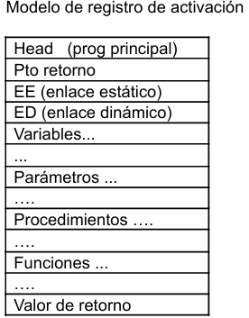
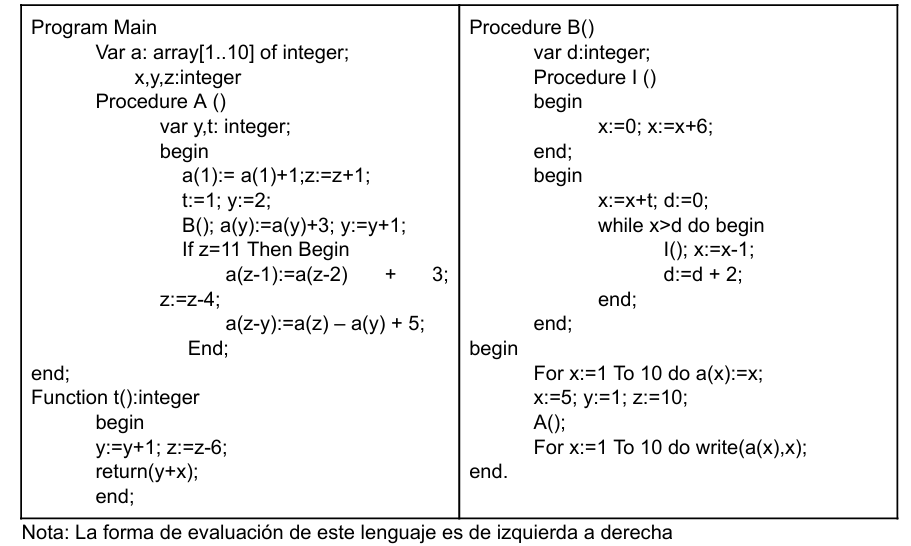
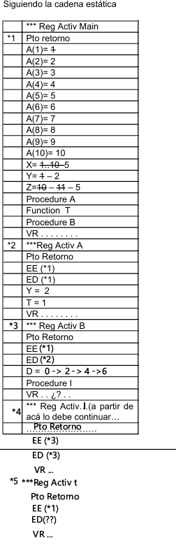

# Conceptos y Paradigmas de Lenguajes de Programación  2026 
# Práctica Nro 5 - Pilas de Ejecución 

### Objetivo:  Interpretar cómo se organiza la memoria de datos durante la ejecución de un programa con  llamados a subrutinas. 

### Ejercicio 1: Explique claramente cual es la utilidad del registro de activación  y  que representan cada una de sus partes.(Basado en el modelo debajo detallado) 

> El ***Registro de Activación*** es el bloque de memoria que se crea cada vez que una función o procedimiento comienza a ejecutarse. Cada vez que se llama a una función, se necesita un espacio nuevo e independiente para que sus datos no se mezclen con los de la llamada anterior.
> - ***Punto de Retorno:*** Guarda la dirección de la próxima instrucción que debe ejecutar el procesador una vez que esta rutina termine. Es el mapa para volver al llamador.
> - ***Enlace Estático (EE):*** Es un puntero que apunta al RA donde esta función fue definida físicamente en el código. Es la clave para que la función pueda "ver" variables que no son suyas pero que están en un nivel superior (scope).
> - ***Enlace Dinámico (ED):*** Es un puntero que apunta al RA de quien te llamó. Sirve para saber qué RA "desapilar" de la memoria cuando esta función finalice.
> - ***Variables Locales y Parámetros:*** Son los datos propios de esa instancia. Los parámetros son los valores que recibe, y las locales son las que se declaran adentro.
> - ***Procedimientos:*** No retornan valor (en algunos lenguajes se simulan con funciones void o none).
> - ***Funciones:*** Retornan un valor.
> - ***Valor de Retorno:*** Solo presente en *funciones*. Es el hueco donde se deja el resultado final para que el llamador lo pueda recoger.

### Ejercicio 2: Dado el siguiente programa escrito en Pascal-like, continuar la realización de las pilas de ejecución hasta finalizar las mismas. 
 
### a) Siguiendo la cadena estática b) Siguiendo la cadena dinámica

