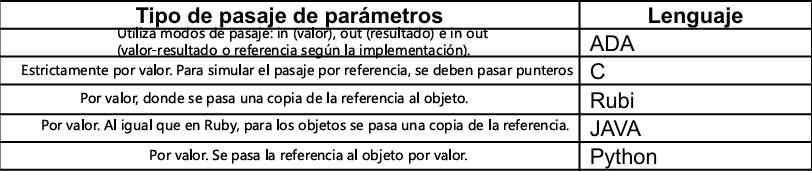
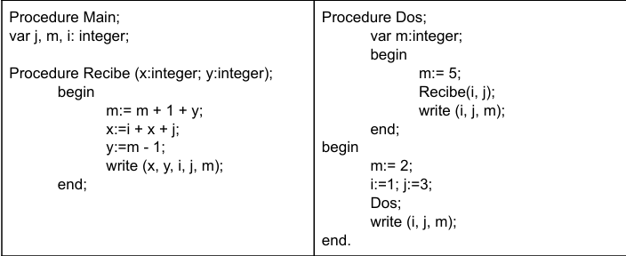
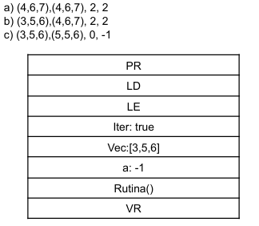

# Conceptos y Paradigmas de Lenguajes de Programación  2026 
# Práctica Nro 6 - Parámetros

### Objetivo:  Descubrir las técnicas existentes para pasaje de parámetros entre unidades y sus diferencias esenciales de acuerdo al lenguaje que lo implementa.

### Ejercicio 1: 
#### a- Explique brevemente los siguientes conceptos 

    ● Parámetro: forma de comunicarse entre dos unidades.
    ● Parámetro real: Los parámetros reales son los valores, variables o expresiones que se pasan al invocar la rutina.
    ● Parámetro formal: Los parámetros formales son las variables locales a la rutina definidas en su cabecera.
    ● Ligadura posicional: La correspondencia se establece por el orden en la lista de parámetros.
    ● Ligadura por palabra clave o nombre: Se asocian explícitamente (ej. y => 4), lo que permite cambiar el orden pero requiere conocer los nombres de los formales.

### Ejercicio 2: Unir los siguientes puntos según corresponda y de una definición y un ejemplo de cada par. 

> ***MODO IN:*** valor, valor constante (La información fluye solo desde el llamador hacia la rutina. Se copia el valor del parámetro real en el formal. Si la rutina modifica el parámetro formal, el valor original del llamador no cambia)

> ***MODO OUT***: resultado, resultado de funciones (La información fluye solo desde la rutina hacia el llamador. El parámetro formal no tiene un valor inicial útil; al finalizar la ejecución, el valor contenido en el formal se copia al parámetro real)

> ***MODO IN/OUT:*** valor-resultado (Combina IN y OUT. El valor se copia al entrar a la rutina y el resultado final se vuelve a copiar al parámetro real solo al terminar la ejecución.), referencia (El parámetro formal se convierte en un alias del real (comparten el mismo l-valor o dirección de memoria). Cualquier cambio dentro de la rutina se refleja instantáneamente en el llamador), nombre (Introducido por ALGOL60. Funciona mediante una sustitución textual: el parámetro formal es reemplazado por la expresión del real cada vez que se encuentra. Esto implica una evaluación perezosa/diferida: la dirección o el valor se recalculan en cada uso)

### Ejercicio 3: 

### a- Complete el siguiente cuadro según lo correspondiente a cada lenguaje: 

### b- Ada es más seguro que Pascal, respecto al pasaje de parámetros en las funciones. Explique por qué.

> Ada se considera más seguro que Pascal por: *Restricción* de efectos laterales en funciones, (los parámetros de las funciones están restringidos obligatoriamente al modo in) por ende, *ausencia* de parámetros por referencia en funciones e *inmutabilidad de los parámetros formales*: en el modo in de Ada, el parámetro formal es tratado como una constante dentro del cuerpo de la rutina, impidiendo cualquier intento de asignación accidental que sí podría ocurrir en Pascal si se olvida la palabra clave VAR o se maneja incorrectamente el alcance.

### c- Explique cómo maneja Ada los tipos de parámetros in-out de acuerdo al tipo de dato

> Ada no define un único mecanismo de implementación (como "copia" o "referencia") para el modo in out, sino que lo decide basándose en la eficiencia y la seguridad según el tipo de dato:  

> ***Tipos Escalares (Enteros, Reales, Enumerados):*** Se implementan generalmente mediante Valor-Resultado (también llamado copy-in/copy-out). El valor se copia del parámetro real al formal al inicio, y del formal al real solo si la unidad termina normalmente.  

> ***Tipos Compuestos (Arreglos, Registros):*** El lenguaje permite al compilador elegir entre Valor-Resultado o Referencia. Normalmente, se utiliza la referencia para evitar el costo de copiar grandes estructuras de datos en memoria.  

> ***Tipos de Acceso (Punteros):*** Se pasan por valor (copiando la dirección), pero dado que permiten modificar el objeto apuntado, actúan funcionalmente como un pasaje donde se puede alterar el contenido original.  

> ***Seguridad en caso de error:*** Una característica clave del manejo de Ada (cuando usa Valor-Resultado) es que si la rutina aborta por una excepción, el parámetro real conserva su valor original porque la "copia de salida" nunca llega a ejecutarse, evitando estados inconsistentes en el llamador.

### Ejercicio 4: Sea el siguiente programa escrito en Pascal-like 

### a- Arme el árbol de anidamiento sintáctico y el registro de activación de cada una de las unidades. 

### b- Decir qué imprime el programa suponiendo que para todas las variables que se pasan el pasaje de parámetros es por: (Deberá hacer la pila estática y dinámica para cada caso) 
    i- Referencia. ii- Valor iii-Valor Resultado iv- Nombre v-Resultado. 

### c- ¿Existió algún caso que no pudo realizarlo porque saltó algún tipo de error? Diga cuál y por qué. 

### d- ¿Dará el mismo resultado si se trata de un lenguaje que sigue la cadena dinámica? Justifique la respuesta realizando las pilas de activación 

### Ejercicio 5: Suponiendo que se está ejecutando un programa con el siguiente registro de activación en memoria y se llama al procedimiento rutina(iter,vec,a). Determine el tipo de parámetro que se deben utilizar en el llamado para que los resultados sean los siguientes: 

    …... 
    procedura rutina(tipoParam iteracion,tipoParam vector,tipoParam vit): 
    
        while iteracion begin 
        vit = a+1 
            vector[vit] = vector[vit]+1 
            iteracion = (vector[vit] mod 2)==0 
    end 
    print vec 
    print vector 
    print vit 
    print a 
    ….. 
    
    rutina(iter,vec,a)

> ***a)*** En este caso, se pasan los 3 parámetros por REFERENCIA para poder conseguir esos resultados. Se ve que los cambios ocurren inmediatamente en `rutina`.

> ***b)*** Acá, los parámetros `iteracion` y `vit` son pasados por REFERENCIA y el parámetro `vector` es pasado por VALOR, no se ve reflejado su cambio en el print.

> ***c)***   ???

### Ejercicio 6:Indique con un ejemplo el comportamiento del parámetro por nombre (en el parámetro formal) para los siguientes casos de parámetros reales:  
    ● Un valor entero: 
        Ejemplo: procedimiento P(nombre x); begin x := x + 1 end; llamado con P(mi_variable);.

        Comportamiento: Se comporta igual que un pasaje por Referencia.

        Qué sucede: El texto mi_variable reemplaza a x. Cada vez que el procedimiento accede a x, está accediendo directamente a la celda de memoria de mi_variable. Si la variable cambia dentro o fuera (vía global), el cambio es instantáneo.

    ● Una constante:
        Ejemplo: procedimiento P(nombre x); begin print(x) end; llamado con P(10);.

        Comportamiento: Se comporta como un pasaje por Valor de solo lectura.

        Qué sucede: El número 10 se sustituye en el código. Si el procedimiento intenta hacer x := 20, el programa fallará (error de L-Value) porque no se puede asignar un valor a una constante literal (10 := 20 es ilegal). 

    ● Un elemento de un arreglo:
        Ejemplo: procedimiento P(nombre x); begin i := i + 1; x := 0 end; llamado con P(A[i]);.

        Comportamiento: Es el caso más distintivo del pasaje por nombre.

        Qué sucede: La expresión A[i] se evalúa cada vez que se usa x. Si el índice i cambia dentro del procedimiento antes de usar x, el parámetro pasará a referenciar una posición distinta del arreglo. En el ejemplo, si i era 1, al hacer i := i + 1 y luego x := 0, se pondrá en cero A[2], no A[1].

    ● una expresión:    
        Ejemplo: procedimiento P(nombre x); begin print(x); print(x) end; llamado con P(y + z);.

        Comportamiento: La expresión se re-calcula en cada mención.

        Qué sucede: No se pasa el "resultado" de y + z, sino la fórmula. Si entre el primer print(x) y el segundo, la variable y cambia su valor (por ejemplo, mediante una interrupción o porque es global), los dos print mostrarán resultados distintos aunque usen el mismo parámetro.

### Que sucede en cada caso? 