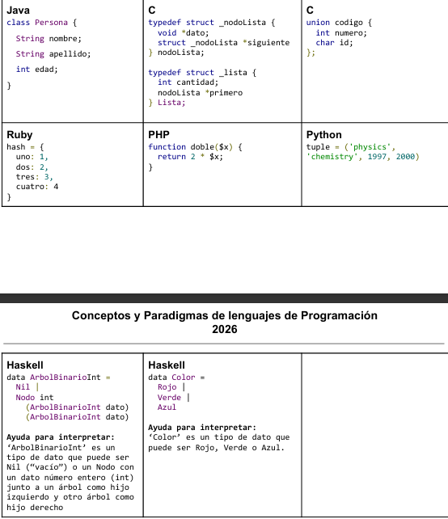

# Conceptos y Paradigmas de Lenguajes de Programación  2026 
# Práctica Nro 7 - Sistemas y tipos de Datos 

### Objetivo:  Comprender las nociones fundamentales sobre las diversas propiedades de los sistemas de tipos y los tipos de datos 

### Ejercicio 1: Sistemas de Tipos:

#### 1. ¿Qué es un sistema de tipos y cuál es su principal función?

> Un Sistema de Tipos es el conjunto de reglas que utiliza un lenguaje de programación para estructurar y organizar sus tipos de datos. Su objetivo principal es garantizar que se escriban programas seguros, detectando y previniendo errores de tipo (tanto sintáctico como semántico). 

#### 2. Definir y contrastar las definiciones de un sistema de tipos fuerte y débil (probablemente en la bibliografía se encuentren dos definiciones posibles. Volcar ambas en la respuesta). Ejemplificar con al menos 2 lenguajes para cada uno de ellos y justificar. 

> ***Tipado Fuerte (Type Safety):*** Ocurre cuando el lenguaje impone restricciones estrictas sobre cómo pueden operar entre sí valores de distintos tipos. En un lenguaje fuertemente tipado, el compilador (o intérprete) asegura que no se producirán errores de tipo en ejecución, o bien, garantiza que todos los errores de tipo sean detectados rápidamente para evitar comportamientos inesperados. Ejemplo: Python y Gobstones. 

> ***Tipado Débil:*** Tiene reglas mucho más permisivas, tolerando que operaciones entre tipos diferentes se lleven a cabo sin tantas restricciones, lo que puede derivar en errores difíciles de rastrear. Ejemplo: C. 

#### 3. Además de la clasificación anterior, también es posible caracterizar el tipado como estático o dinámico. ¿Qué significa esto? Ejemplificar con al menos 2 lenguajes para cada uno de ellos y justificar.

> ***Tipado Estático:*** Las ligaduras de tipo se realizan durante la compilación. Para lograrlo, exige que todas las variables y operaciones declaren o especifiquen explícitamente sus tipos de datos y los tipos de retorno asociados. Ej: Java y C.

> ***Tipado Dinámico:*** Las ligaduras de tipo se resuelven en tiempo de ejecución. Esto otorga gran flexibilidad al programador, pero provoca que el sistema deba realizar muchas más comprobaciones en vivo. Ej: Python y Ruby.

### Ejercicio 2: Tipos de datos: 

#### 1. Dar una definición de tipo de dato. 
> El concepto de Tipo de Datos en los lenguajes de programación surge fundamentalmente de la necesidad de organizar y clasificar la información en diferentes categorías. Más allá de ser una simple agrupación, los tipos de datos aportan un comportamiento semántico o sentido a la información que el programa está procesando. Por lo tanto, la definición formal establece que un tipo de datos es un conjunto de valores y un conjunto de operaciones que se pueden utilizar para manipularlos. 

#### 2. ¿Qué es un tipo predefinido elemental? Dar ejemplos. 
> Son aquellos tipos básicos (también conocidos como built-in o primitivos) que forman parte del propio lenguaje de programación. Su característica central es que reflejan el comportamiento del hardware subyacente y actúan como una abstracción de este.  
> La clasificación tradicional de estos tipos predefinidos incluye: ***Números*** (se dividen habitualmente en Enteros y Reales), ***Caracteres*** y ***Booleanos***. 

#### 3. ¿Qué es un tipo definido por el usuario? Dar ejemplos. 
> Los lenguajes permiten al programador crear sus propias agrupaciones a partir de objetos de datos elementales y, de forma recursiva, a partir de otros agregados. La característica central de estos tipos es que separan la especificación de la implementación, permitiendo definirexactamente la estructura que el problema necesita .

### Ejercicio 3: Tipos compuestos:

#### 1. Dar una breve definición de: producto cartesiano (en la bibliografía puede aparecer también como product type), correspondencia finita, uniones (en la bibliografía puede aparecer también como sum type) y tipos recursivos. 

> - **Producto Cartesiano (Registros/Estructuras)** El producto cartesiano agrupa n-tuplas de distintos elementos . En la práctica, esto se traduce en las estructuras o registros (como `struct` en C o `Record`). Permiten agrupar variables de tipos diferentes bajo un mismo nombre, accediendo a cada campo individual a través de una notación puntual (ej. `pol.nro_lados = 4`). 

> - **Correspondencia Finita (Arreglos/Diccionarios)** Consiste en una función matemática que enlaza un conjunto de valores finitos de un "tipo dominio" (los índices) con elementos de un "tipo resultado". Esta es la base teórica de los arreglos, listas, diccionarios y colecciones, donde se accede a los elementos mediante un subíndice (ej. mi_var = lista). 

> - **Unión y Unión Discriminada** Permite definir un tipo como la disyunción de varios tipos posibles, logrando que distintos tipos compartan la misma ubicación de memoria (el lenguaje reserva solo el espacio necesario para el campo de mayor tamaño). Sin embargo, esto acarrea un riesgo: en cualquier momento, el espacio solo contiene un valor válido y, si es una unión simple, el sistema no recuerda qué tipo se está guardando. Para resolverlo, existe la Unión Discriminada, la cual le agrega un "discriminante" (una etiqueta o tag) a la estructura que le informa explícitamente al sistema qué variante se está usando en ese momento, lo que permite realizar un chequeo dinámico y un manejo seguro de las opciones. 

> - **Recursión (Listas ligadas/Árboles)** Un tipo recursivo es aquel que se contiene a sí mismo como componente de su propia estructura . Es el constructor definitivo para modelar agrupaciones de datos cuyo tamaño puede crecer arbitrariamente y cuya estructura puede ser infinitamente compleja. Convencionalmente, los lenguajes soportan estos tipos recursivos valiéndose del uso de punteros o referencias para enlazar los distintos componentes (formando listas ligadas o árboles). 

#### 2. Identificar a qué clase de tipo de datos pertenecen los siguientes extractos de código. En algunos casos puede corresponder más de una: 

> - **Java:** Producto Cartesiano en la clase Persona.
> - **C:** Producto Cartesiano en los `struct`.
> - **C(2):** Unión.
> - **Ruby:** Correspondencia finita.
> - **PHP:** Correspondencia finita.
> - **Python:** Correspondencia finita.
> - **Ruby:** Correspondencia finita.
> - **Haskell:** Recursión.
> - **Haskell(2):** Unión.

### Ejercicio 4: Mutabilidad/Inmutabilidad: 

#### 1. Definir mutabilidad e inmutabilidad respecto a un dato. Dar ejemplos en al menos 2 lenguajes. TIP: indagar sobre los tipos de datos que ofrece Python y sobre la operación #freeze en los objetos de Ruby. 

> La distinción no se basa en si una variable puede cambiar de valor (eso es reasignación), sino en si el estado interno del objeto puede ser modificado una vez que ha sido creado en la memoria.

> **Mutabilidad:** Un objeto es mutable si su contenido o estado puede ser alterado después de su creación sin cambiar su identidad (su dirección de memoria o L-Value). Las operaciones de modificación actúan "in-place".

> **Inmutabilidad:** Un objeto es inmutable si su estado no puede cambiar después de ser creado. Cualquier operación que parezca "modificar" el objeto en realidad devuelve un nuevo objeto con el valor actualizado, dejando el original intacto.

##### Python:

***Tipos mutables (Listas):***

    mi_lista = [1, 2, 3]
    id_original = id(mi_lista)
    mi_lista.append(4) 
    print(id(mi_lista) == id_original) # True: El objeto es el mismo, su contenido cambió.

***Tipos Inmutables (Tuplas y Strings):***

    mi_tupla = (1, 2, 3)
    # mi_tupla[0] = 5  <- Esto daría un TypeError

    nombre = "Hola"
    nuevo_nombre = nombre + " Mundo" # Crea un objeto nuevo en otra dirección de memoria.

##### Ruby:

***Comportamiento normal (Mutable):***
    s = "Hola"
    s << " Mundo" # Modifica el string original

***Uso de #freeze:***
    s = "Hola".freeze
    s << " Mundo" # Lanza error: can't modify frozen String

#### 2. Dado el siguiente código: 
    a = Dato.new(1) 
    a = Dato.new(2) 
#### ¿Se puede afirmar entonces que el objeto “Dato.new(1)” es mutable? Justificar la respuesta sea por afirmativa o por la negativa.

> No, lo que sucede en ese código es una reasignación de la variable, no una mutación del objeto.

> 1. Primero, la variable a apunta a una celda de memoria donde reside el objeto con valor 1.

> 2. Luego, se crea un objeto completamente nuevo con valor 2 y se le asigna a a.

> 3. El objeto original (Dato.new(1)) permanece inalterado en la memoria (hasta que el Garbage Collector lo limpie) y nunca cambió su estado interno. Para afirmar que es mutable, tendríamos que ver una operación como a.setValor(2) que mantuviera la identidad del objeto

### Ejercicio 5: Manejo de punteros:

#### 1. ¿Permite C tomar el l-valor de las variables? Ejemplificar.

> Sí. En el lenguaje C, el operador & (operador de dirección) permite obtener el L-valor (la ubicación en memoria) de una variable.Cuando usamos el operador &, le estamos pidiendo al sistema que nos devuelva la dirección donde esa variable está almacenada en la memoria D (Zona de Datos). *Ejemplo:*

    int x = 10;      // Variable entera
    int *ptr;        // Declaración de un puntero a entero

    ptr = &x;        // 'ptr' ahora guarda el L-valor de 'x' (su dirección)

    printf("El valor de x es: %d\n", x);
    printf("La dirección de x (L-valor) es: %p\n", (void*)&x);
    printf("El puntero ptr apunta a: %p\n", (void*)ptr);

#### 2. ¿Qué problemas existen en el manejo de punteros? Ejemplificar. 

> Existen 6 tipos de inseguridades en el manejo de punteros:

> - ***Violación de tipos:*** Apuntar a algún valor que no es del mismo tipo.
> - ***Referencias sueltas:*** Si este objeto no está alocado se dice que el puntero esSi este objeto no está alocado se dice que el puntero es peligroso (dangling). Una referencia suelta o dangling es un puntero que contiene una dirección de una variable dinámica que fue desalocada. Si luego se usa el puntero producirá error.
> - ***Punteros no inicializados:*** Peligro de acceso descontrolado a posiciones de memoria. Verificación dinámica de la inicialización La solución es un *valor especial nulo*.
> - ***Punteros y uniones discriminadas:*** En el caso de C, este es el mismo efecto que causa la aritmética de punteros. Para resolver este problema asociado con los punteros Java elimina la noción de puntero explícito completamente.
> - ***Alias:*** confusión con los nombres de las variables.
> - ***Liberación de memoria:*** objetos perdidos. Las variables puntero se alocan como cualquier otra variable en la pila de registros de activación variable en la pila de registros de activación.

### Ejercicio 6: TAD :

#### 1. ¿Qué características debe cumplir una unidad para que sea un TAD?
> Tipo abstracto de dato (TAD) es el que satisface:

> ***Encapsulamiento***: la representación del operaciones permitidas para los objetos del tipo se describen en una única unidad sintáctica.Refleja las abstracciones descubiertas en el diseño

> ***Ocultamiento de la información:*** la representación de los objetos y la implementación del tipo permanecen ocultos.Refleja los niveles de abstraccion.        

#### 2. Dar algunos ejemplos de TAD en lenguajes tales como ADA, Java, Python, entre otros

> - **ADA** fue uno de los lenguajes que introdujo el soporte formal para TADs mediante el uso de Packages (paquetes) y la palabra clave private.

> - En **Java**, las Clases son el mecanismo natural para crear TADs. El ocultamiento se logra mediante modificadores de acceso (private, protected, public).

> - **Python** es un lenguaje muy flexible que no impone el ocultamiento de forma estricta por hardware o compilador, sino por convención.

> - En Modula-2, el TAD se implementa mediante Tipos Opacos. El módulo de definición solo declara el nombre del tipo, pero no su estructura.
