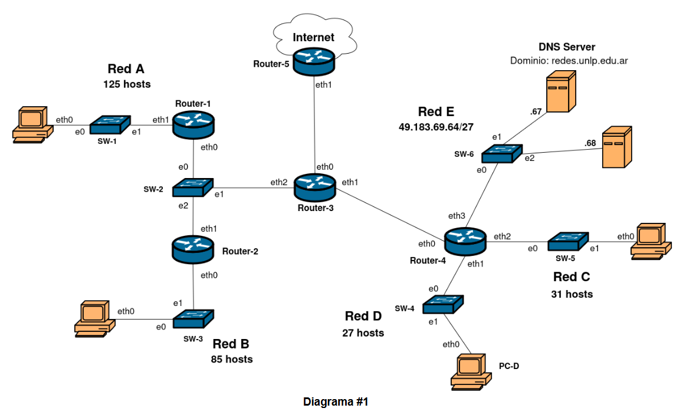
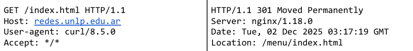
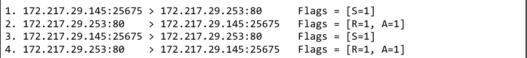

# Parcial Redes y Comunicaciones - 1era Fecha 2do Semestre 2025

### 1) Utilizando el bloque de red 49.183.68.0/23: 
#### a.  Asignar direcciones de red a cada una de las redes de la topología del Diagrama #1. 
#### b.  Desperdiciar la menor cantidad de direcciones posibles. 

 
 
                                     |-----> 49.183.68.0/25 (Red A, 125 hosts + 2) 
               |----> 49.183.68.0/24--   
               |                     |-----> 49.183.68.128/25 (Red B, 85 hosts + 2)
               |
    49.183.68.0/23 
               |                                            |----> 49.183.69.0/26 (Red C, 31 hosts + 2)
               |                      |-----> 49.183.69.0/25 
               |                      |                     |----> 49.183.69.64/26 ----> 49.183.69.64/27 (Red E, ya asignada)
               |                      |                                           |
               |                      |                                           |
               |                      |                                           |------> 49.183.69.96/27 (Red D, 27 hosts + 2)
               |-----> 49.183.69.0/24--             
                                      |
                                      |                      |----> 49.183.69.128/26----> 49.183.69.128/27---> 49.183.69.128/28----> 49.183.69.128/29 (R1-R2-R3)
                                      |                      |                      |                     |--> 49.183.69.144/28  |-> 49.183.69.136/29 (sigue)
                                      |                      |                      |---> 49.183.69.160/27
                                      |-----> 49.183.69.128/25
                                                             |
                                                             |----> 49.183.69.194/26 (Red Libre)

                    |----> 49.183.69.136/30 (R3-R5)
        49.183.69.136/29   
                    |----> 49.183.69.140/30 (R3-R4)

#### c.  Asignar direcciones IP a todas las interfaces de los dispositivos de la topología.

> - ***Red A (49.183.68.0/25)*** 
>   - *R1_eth1:* 49.183.68.1
>   - *PC_eth0:* 49.183.68.2

> - ***Red B (49.183.68.128/25)*** 
>   - *R2_eth0:* 49.183.68.129
>   - *PC_eth0:* 49.183.68.130

> - ***Red C (49.183.69.0/26)*** 
>   - *R4_eth2:* 49.183.69.1
>   - *PC_eth0:* 49.183.69.2

> - ***Red D (49.183.69.96/27)*** 
>   - *R4_eth1:* 49.183.69.97
>   - *PC-D:* 49.183.69.98

> - ***Red E (49.183.69.64/27)*** 
>   - *R4_eth3:* 49.183.69.65
>   - *DNS Server* 49.183.69.67
>   - *PC_eth2* 49.183.69.68

> - ***Red e/ routers (R1-R2-R3) (49.183.69.128/29)*** 
>   - *R3_eth2:* 49.183.69.129
>   - *R1_eth0:* 49.183.69.130
>   - *R2_eth1:* 49.183.69.131

> - ***Red e/ routers (R3-R5)(49.183.69.136/30)*** 
>   - *R3_eth0:* 49.183.69.137
>   - *R5_eth1:* 49.183.69.138

> - ***Red e/ routers (R3-R4)(49.183.69.140/30)*** 
>   - *R3_eth1:* 49.183.69.141
>   - *R4_eth0:* 49.183.69.142

### 2. Armar la tabla de Router-3, considerando que: 
#### a. Todas las redes de hosts deben tener acceso a Internet. 
#### b. Deben poder alcanzarse todas las redes. 
#### c. Sumarizar en caso de que sea posible.

| Destino | Mask | Next-Hop | Iface | 
| :--- | :---: | :---: | :---: |
| **49.183.69.128** | /29 | - | eth2 |
| **49.183.69.140** | /30 | - | eth1 |
| **49.183.69.136** | /30 | - | eth0 |
| **49.183.68.0** | /25 | 49.183.69.130 | eth2 |
| **49.183.68.128**|  /25 | 49.183.69.131 | eth2 |
| **49.183.69.64**|  /27 | 49.183.69.142 | eth1 |
| **49.183.69.96**|  /27 | 49.183.69.142 | eth1 |
| *Sumarizo* **49.183.69.64**|  /26 | 49.183.69.142 | eth1 |
| **49.183.69.0**|  /26 | 49.183.69.142 | eth1 |
| *Vuelvo a Sumarizar* **49.183.69.0**|  /25 | 49.183.69.142 | eth1 |
| **0.0.0.0**|  /0 | 49.183.69.138 | eth0 |

### 3. Suponga que PC-D quiere realizar un Echo Request a la dirección 8.8.8.8. Responda: 
#### a. Teniendo en cuenta que la tabla ARP de PC-D está vacía, ¿qué dirección MAC necesita PC-D para poder comunicarse?
> Como reconoce que la dirección IP 8.8.8.8 no está en su red, necesita la MAC del Router-4 para que envíe el Ping fuera de la red.
#### b. En base a lo anterior, ¿qué dirección IP destino tiene el requerimiento ARP?

> **IP destino:** 49.183.69.97/27 (La IP de la interfaz del Router-4 conectada a la red de PC-D.)

#### c. Detalle los datos del ARP Request y su trama Ethernet que envía la interfaz eth0 de Router-4. 

##### ARP Request
> - **MAC destino:** 00:00:00:00:00:00
> - **MAC origen:** MAC_R4_eth0
> - **IP destino:** 49.183.69.141/30
> - **IP destino:** 49.183.69.142/30

##### Trama Ethernet
> - **MAC destino:** FF:FF:FF:FF:FF:FF
> - **MAC origen:** MAC_R4_eth0

### 4. Sobre los dispositivos de capa de enlace: 
#### a. ¿Qué dispositivos dividen dominios de broadcast? Indique la cantidad de dominios de broadcast en el Diagrama #1.

> Lo dividen los ***Routers***. Hay 8 dominios de broadcast en total.

#### b. ¿Qué dispositivos dividen dominios de colisión? Indique la cantidad de dominios de colisión en el Diagrama #1. 

> Lo dividen los ***Routers*** y los ***Swtiches***. Hay 16 dominios de colisión en total.

### 5. En base a la topología del Diagrama #1. Si quisiera ofrecer un servicio web en el host con IP 49.183.69.68 bajo el dominio parcial.redes.unlp.edu.ar, ¿qué modificación, en qué protocolo/s y dónde debería realizarse a nivel capa de aplicación para que sea accesible desde Internet? 

> Se debería realizar una modificación en el Servidor DNS autoritativo de `redes.unlp.edu.ar`. Debería agregarse los siguientes registros:

> - parcial.redes.unlp.edu.ar   IN    **A**   49.183.69.68

### 6. A partir del intercambio siguiente: 

#### a. ¿Obtuvo el recurso solicitado? En caso negativo, ¿qué acción debe tomar el cliente para poder obtener el recurso? 
> No se obtuvo el recurso solicitado porque este fue movido de lugar (***301 Moved Permanently***). El cliente debe ir a buscar el recurso a la ubicación que indica la cabecera ***Location*** (/menu/index.html).

#### b. Indique el protocolo de capa de transporte y el puerto destino al que se realizó la petición HTTP.

> El protocolo es TCP, y HTTP corre sobre el puerto 80 por default.

### 7. Observe la siguiente captura de tráfico y responda:

#### a. ¿Qué está intentando hacer el host 172.217.29.145? 
> Está intentando establecer conexión con *172.217.29.253:80* a través de 3WH.

#### b. ¿Qué conclusión puede sacar en base a las respuestas recibidas?

> No hay ningún proceso escuchando en el puerto 80 de la dirección 172.217.29.253, ya que lo rechaza inmediatamente con el flag de RST (R = 1).

#### c. ¿Podría el host 172.217.29.253 tener los puertos 110 (UDP) y el 110 (TCP) abiertos al mismo tiempo? Justifique. 

> Si, ***UDP*** y ***TCP*** pueden convivir escuchando en el mismo puerto sin ningún problema porque funcionan de forma independiente.