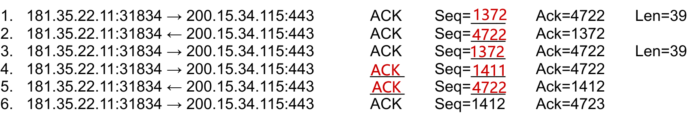
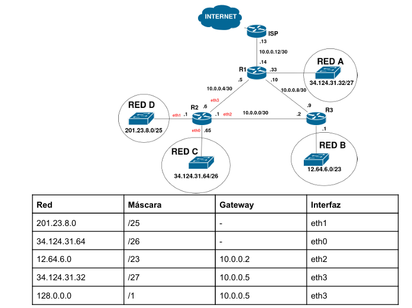

# Parcial Redes y Comunicaciones - 3era Fecha 2do Semestre 2025

### 1. Dada la siguiente topología

### a) Indicar en orden todos los mensajes de capa de enlace (ARP Request, ARP Reply y la trama Ethernet) que envía y recibe Router para que WWW reciba un requerimiento HTTP de PC-B. 

> - Primero recibe el ARP Request de PC-B, ya que la PC-B sabe que WWW no se encuentra en su red. Así que recibe ese mensaje porque es el gateway de PC-B.

> - Luego recibe el ARP Reply por parte de WWW, que dice que la dirección IP es suya y devuelve su dirección MAC

> - Por último, envía la trama Ethernet hacia la MAC_WWW_eth0, con el contenido de la HTTP Request.

### b) Suponer que PC-B hace un ping exitoso (ida y vuelta) a PC-A. Indicar cómo se van agregando las entradas a la tabla CAM del switch SW-1 considerando los mensajes de los incisos a) y b).

> - Luego del *inciso a)*:
>   - MAC_PC-B_eth0, MAC_ROUTER_eth0

> - PC-B envía el *Echo-Request*:
>   - MAC_PC-B_eth0, MAC_ROUTER_eth0

> - PC-A envía el *Echo-Reply*:
>   - MAC_PC-B_eth0, MAC_ROUTER_eth0, MAC_PC-A_eth0

### c) Indicar cantidad de dominios de broadcast y los dispositivos que los dividen. 

> Hay 2 dominios de Broadcast, son divididos por los ***Routers***.
### d) Indicar cantidad de dominios de colisión y los dispositivos que los dividen.

> Hay 4 dominios de colisión, son divididos por los ***Routers*** y ***Switches***.

### Ejercicio 2) A partir del bloque 172.10.200.0/23 asignar direcciones a las redes según la cantidad de hosts que necesita cada una: Red A (35 hosts), Red B (254 hosts), Red C (126 hosts) y Red D (15 hosts). Se debe desperdiciar la menor cantidad de direcciones posible. Indique además redes libres si las hubiese. Para cada una de las redes asignadas deberá indicar dirección de red y máscara.

                        |-----> 172.10.200.0/24 (Red B, 254 hosts + 2)
                        |
                        |
    172.10.200.0/23 -----
                        |                       |-----> 172.10.201.0/25 (Red C, 126 hosts + 2)
                        |                       |
                        |-----> 172.10.201.0/24--
                                                |                          |-----> 172.10.201.128/26 (Red A, 35 hosts + 2)
                                                |                          |
                                                |-----> 172.10.201.128/25---                         |-----> 172.10.201.192/27 (Red D, 15 hosts + 2 )
                                                                           |                         |
                                                                           |-----> 172.10.201.192/26--
                                                                                                     |
                                                                                                     |-----> 172.10.201.224/27 (Red Libre)

### Ejercicio 3) Dada la siguiente captura de tráfico: 
### a) Complete los campos faltantes:       

### b) Suponga que en la línea 2 el host 200.15.34.115 envía el campo WIN=0. ¿Qué hubiese pasado? ¿De qué mecanismo de capa de transporte se trata?

> Hubiese pasado que el emisor habría dejado de enviar datos inmediatamente porque el receptor no tiene espacio en su ventana para recibir, entra en participación el ***Control de Flujo***, que es justamente quien controla que el emisor no sature de datos al receptor.

 
### Ejercicio 4) Dada la siguiente topología y sabiendo que la tabla de ruteo de R2 tiene errores:

a) Qué haría el router R2, con la configuración actual, si llegara un paquete IP con: 
 
1) **IP Origen:** 8.8.8.8 **IP Destino:** 34.124.31.100
> Lo puede enviar por *Red C*
2) **IP Origen:** 189.3.122.245 **IP Destino:** 201.23.8.200
> No lo envía porque al ser 201.23.8.200/25 solo cubre hasta .127, lo descarta en su DG
3) **IP Origen:** 13.27.46.128 **IP Destino:** 34.124.31.61
> Lo envía por *Red A*
4) **IP Origen:** 134.54.76.4 **IP Destino:** 8.8.8.8 
> Lo descarta porque *no tiene salida a internet.*

b) ¿La configuración actual de R2 tiene salida a Internet? ¿La configuración es correcta?

No, su DG está mal configurada, no puede salir a internet.

c) Corregir los errores hallados. Considerar que se debe poder llegar a todas las redes de la topología. 

> Le agrego las redes faltantes:

| Destino | Mask | Next-Hop | Iface | 
| :--- | :---: | :---: | :---: |
| ***0.0.0.0*** | /0 | 10.0.0.5| eth3 |
| ***10.0.0.4*** | /30 | - | eth3 |
| ***10.0.0.0*** | /30 | - | eth2 |
| ***10.0.0.8*** | /30 | 10.0.0.2 | eth2 |
| ***10.0.0.12*** | /30 | 10.0.0.5 | eth3 |

### Ejercicio 5) Responda:

### a) Explique brevemente las principales características de los protocolos POP e IMAP. 
> ***POP3*** e ***IMAP*** son protocolos de capa de aplicación para la recepción de *mails*. Ambos corren sobre TCP en el puerto 110 y 143, respectivamente. Ambos requieren autenticación y permiten trabajar de manera segura (TLS). La diferencia entre ambos está en la simplicidad que maneja ***POP***, donde su mecanismo se basa en desacrgar los mails y luego borrarlos. Además, no mantiene estados de carpetas y mensajes y puede ser limitante para usuarios que quieren acceder desde varios dispositivos. En cambio, ***IMAP*** mantiene los mensajes en el servidor, tiene una funcionalidad más avanzada que permite la sincronización de carpetas y mensajes y ver contenido como Mensajes MIME.

### b) ¿Por cuál registro debería consultar para obtener el servidor de nombre primario de un dominio? 
> El registro por el cual se debe consultar es el ***SOA***,este registro tiene toda la información adminsitrativa sobre un nombre de dominio.

### c) ¿Es obligatoria la cabecera “Host” en HTTP 1.1?

> Si, en HTTP 1.1 la cabecera Host es obligatoria, esto permite el Virtual Hosting, es decir, que un único servidor con una sola dirección IP pueda alojar múltiples dominios distintos.
 
### Ejercicio 6) Indique para cada afirmación, si es verdadero o falso. Justifique en todos los casos. 

### a) 2001:db8::1234:5678::9abc es una dirección IPv6 válida.
> ***Falso***. Los dos puntos `::` solo se pueden usar una vez en cada dirección.

### b) Una interfaz de red puede tener configuradas dos direcciones IPv6. 
> ***Verdadero***. En IPv6, una interfaz de red suele tener como mínimo Dirección Link-Local y Dirección Global Unicast (GUA):

### c) El protocolo IPv6 puede funcionar correctamente sin ICMPv6. 

> ***Falso***, ICMPv6 es una parte integral y esencial del protocolo.