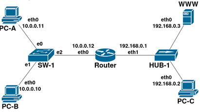

# Parcial Redes y Comunicaciones - 3era Fecha 2do Semestre 2025

### 1. Dada la siguiente topología

### a) Indicar en orden todos los mensajes de capa de enlace (ARP Request, ARP Reply y la trama Ethernet) que envía y recibe Router para que WWW reciba un requerimiento HTTP de PC-B. 

> - Primero recibe el ARP Request de PC-B, ya que la PC-B sabe que WWW no se encuentra en su red. Así que recibe ese mensaje porque es el gateway de PC-B.

> - Luego recibe el ARP Reply por parte de WWW, que dice que la dirección IP es suya y devuelve su dirección MAC

> - Por último, envía la trama Ethernet hacia la MAC_WWW_eth0, con el contenido de la HTTP Request.

### b) Suponer que PC-B hace un ping exitoso (ida y vuelta) a PC-A. Indicar cómo se van agregando las entradas a la tabla CAM del switch SW-1 considerando los mensajes de los incisos a) y b).

> - Luego del *inciso a)*:
>   - MAC_PC-B_eth0, MAC_ROUTER_eth0

> - PC-B envía el *Echo-Request*:
>   - MAC_PC-B_eth0, MAC_ROUTER_eth0

> - PC-A envía el *Echo-Reply*:
>   - MAC_PC-B_eth0, MAC_ROUTER_eth0, MAC_PC-A_eth0

### c) Indicar cantidad de dominios de broadcast y los dispositivos que los dividen. 

> Hay 2 dominios de Broadcast, son divididos por los ***Routers***.
### d) Indicar cantidad de dominios de colisión y los dispositivos que los dividen.

> Hay 4 dominios de colisión, son divididos por los ***Routers*** y ***Switches***.