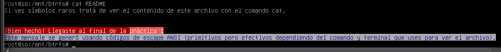

# SISTEMAS OPERATIVOS -  Práctica 1

---

## A - Introducción 

El propósito de esta primera sección de la práctica es introducir los conceptos 
preliminares que necesitarde esta guía de estudio.

### 1.  ¿Qué es GCC? 

> GCC es el compilador de C en el proyecto GNU. Es la herramienta principal utilizada para transformar el código fuente del kernel Linux (escrito mayormente en C y Assembler) en un binario ejecutable. Lo usamos también para crear **archivos objeto** y para realizar el enlazado final que crea el archivo ejecutable.

### 2.  ¿Qué es make y para que se usa? 

> Make es una herramienta fundamental diseñada para organizar y automatizar el proceso de generación de ejecutables u otros archivos a partir de código fuente. Su **función** **principal** es leer un archivo de texto llamado ***Makefile***, el cual contiene un conjunto de reglas que definen cómo se debe construir cada parte de un proyecto. 

> Se usa principalmente para: 
> - ***Gestión de dependencias:*** La herramienta lleva la cuenta de qué archivos de código objeto dependen de qué archivos fuente o de encabezado (.h)
> - ***Eficiencia en la compilación:***  verifica la fecha de modificación de los archivos y solo recompila aquellos que han cambiado desde la última vez que se generó el binariomake.
> - ***Automatización compleja:*** Permite ejecutar procesos largos y complicados con unos pocos comandos sencillos, interpretando directivas que de otro modo deberían ingresarse manualmente en la terminal
> - ***Versatilidad:*** Aunque se asocia principalmente a C, se utiliza para cualquier tarea donde un archivo de salida dependa de otros, como convertir LaTeX o Markdown a PDF, o compilar código en Ensambler y Rust
> - ***Compilación paralela:*** Mediante el parámetro `-jX`, permite ejecutar múltiples tareas de compilación de forma simultánea (donde X es el número de procesadores), acelerando significativamente el proceso en máquinas multinúcleo

### 3.  La carpeta /home/so/practica1/ejemplos/01-make de la VM contiene ejemplos de uso de make. Analice los ejemplos, en cada caso ejecute `make` y luego `make run` (es opcional ejecutar el ejemplo 4, el mismo requiere otras dependencias que  no vienen preinstaladas en la VM): 

### a.  Vuelva a ejecutar el comando `make`. ¿Se volvieron a compilar los programas?  ¿Por qué? 

>No, no se compila de nuevo. Porque `make` es inteligente y si la fecha del compilado anterior es reciente, no pierde tiempo en re-compilar.

### b.  Cambie la fecha de modificación de un archivo con el comando `touch` o  editando el archivo y ejecute `make`. ¿Se volvieron a compilar los programas? ¿Por qué? 

>Si, se vuelven a compilar. Porque ahora el archivo fuente tiene una fecha más reciente que el ejecutable, y make asume que hubo cambios que deben procesarse.

### c.  ¿Por qué “run” es un target “phony”?

>Un target ***Phony*** es aquel que no representa un archivo real que se va a generar. Si no fuera "phony" y por casualidad existiera un archivo llamado run en la carpeta, make nunca ejecutaría el comando porque pensaría que el archivo run ya está listo. Al marcarlo como .PHONY: run, le decís: "Ejecutá los comandos de esta regla siempre, sin importar si existe un archivo con ese nombre".

### d.  En el ejemplo 2 la regla para el target `dlinkedlist.o` no define cómo generar el  target, sin embargo el programa se compila correctamente. ¿Por qué es esto? 

>Esto es por las Reglas Implícitas de `make`. make sabe que para generar un objeto .o casi siempre se necesita un archivo .c con el mismo nombre y se usa el compilador cc o gcc. Si vos no le decís cómo hacerlo, él usa su regla interna por defecto.

### 4.  ¿Qué es el kernel de GNU/Linux? ¿Cuáles son sus funciones principales dentro del Sistema Operativo? 

>El ***Kernel*** es la pieza fundamental del software de un sistema operativo que se ejecuta directamente sobre el hardware en modo kernel. En este modo, el núcleo tiene acceso completo a todo el hardware y puede ejecutar cualquier instrucción que la máquina sea capaz de realizar.

> Sus funciones principales son:  
> - **Gestión de procesos:** Es responsible de la creación y terminación de procesos (programas en ejecución). Utiliza un ***planificador*** (***scheduler***) para decidir qué proceso obtiene acceso a la CPU, cuándo y por cuánto tiempo, permitiendo la multitarea.
> - **Gestión de memoria:** Administra la memoria RAM, asignándola a los procesos de manera equitativa y eficiente. Implementa ***memoria virtual***.
> - **Provisión de un sistema de archivos:** El núcleo gestiona el ***almacenamiento en disco***, permitiendo crear, recuperar, actualizar y eliminar archivos.
> - **Acceso a dispositivos de E/S:** Proporciona una interfaz estandarizada para comunicarse con dispositivos periféricos (teclado, ratón, monitor, discos) a través de los ***drivers o controladores***.

### 5.  Explique brevemente la arquitectura del kernel Linux teniendo en cuenta: tipo de  kernel, módulos, portabilidad, etc. 

> La arquitectura del kernel Linux se caracteriza por ser un diseño ***monolítico***, pero con una estructura altamente flexible y funcional gracias a su capacidad de modularización y abstracción de recursos.

> - ***Tipo de Kernel:*** **Monolítico**
>Linux es un kernel monolítico, lo que significa que todo el sistema operativo (incluyendo la gestión de procesos, memoria, sistemas de archivos y drivers) reside y se ejecuta dentro del espacio del kernel en modo privilegiado. 
> - ***Módulos del Kernel***
>A pesar de su naturaleza monolítica, Linux implementa un diseño modular mediante módulos cargables en caliente.  
>   - ***Funcionalidad:*** Permiten extender las capacidades del núcleo (como agregar soporte para un nuevo dispositivo o un sistema de archivos) sin necesidad de reiniciar el sistema ni recompilar todo el kernel. 
>   - ***Ejecución:*** Estos módulos se cargan en el mapa de memoria del kernel bajo demanda y se ejecutan en modo privilegiado, por lo que un error en un módulo puede comprometer la estabilidad de todo el sistema.

> - ***Portabilidad:*** Aunque originalmente fue desarrollado para la arquitectura x86 (Intel 386), Linux fue diseñado para ser altamente portable>:
>   - ***Lenguajes***: Está escrito mayoritariamente en lenguaje C, lo que facilita su traslado a diferentes arquitecturas de hardware.
>   - ***Abstracción***: Posee una pequeña capa de código dependiente de la máquina escrita en Assembler (para tareas de bajo nivel como el manejo de interrupciones o la inicialización de la CPU) que se reescribe para cada plataforma específica. 

### 6.  ¿Cómo se define el versionado de los kernels Linux en la actualidad?

> En la actualidad, el versionado de los kernels Linux se define mediante una nomenclatura de tres o cuatro números (A.B.C o A.B.C.D), abandonando esquemas antiguos donde se diferenciaba entre versiones estables e inestables por números pares o impares. La estructura actual del versionado se desglosa de la siguiente manera:

> - ***Primer número (Versión):*** Indica la versión principal del kernel (por ejemplo, el 6 en la versión 6.13.7).

> - ***Segundo número (Revisión mayor o serie):*** Indica cambios significativos o nuevas funcionalidades. A diferencia de lo que ocurría antes de la serie 2.6, actualmente cada nueva versión puede contener nuevas características y no existe una separación entre ramas de desarrollo y estables basadas en si este número es par o impar. Los ciclos de lanzamiento de estas versiones suelen ser de aproximadamente tres meses.

> - ***Tercer número (Revisión menor):*** Se refiere a lanzamientos que incluyen soporte para nuevos drivers o mejoras menores.

> - ***Cuarto número (Parches de seguridad o errores):*** Se utiliza cuando una versión estable requiere correcciones urgentes de errores o parches de seguridad. En este caso, se añade un cuarto número secuencial (por ejemplo, el 7 en 6.13.7) para identificar la revisión de esa versión específica sin esperar al siguiente ciclo de desarrollo.

### 7. ¿Cuáles son los motivos por los que un usuario/a GNU/Linux puede querer  re-compilar el kernel?

> Los principales motivos pueden ser: 
> - Soporte de hardware y nuevas funcionalidades
> - Optimización del rendimiento
> - Reducción del tamaño y uso de recursos
> - Soporte para sistemas de archivos específicos
> - Aplicación de parches y actualizaciones 
> - Seguridad

### 8. ¿Cuáles son las distintas opciones y menús para realizar la configuración de opciones de compilación de un kernel? Cite diferencias, necesidades (paquetes adicionales de software que se pueden requerir), pro y contras de cada una de ellas.

> Existen principalmente tres interfaces para generar el archivo `.config`:
> - ***make config:*** Es una interfaz en modo texto y secuencial. Se considera tediosa ya que pregunta por cada opción una por una.
> - ***make xconfig:*** Es una interfaz gráfica basada en ventanas. Su contra es que requiere tener instalado el sistema de ventanas X y librerías de desarrollo de Qt.
> - ***make menuconfig:*** Utiliza la librería ncurses para generar una interfaz de menús y paneles dentro de la terminal. Es la más utilizada por ser flexible y no requerir entorno gráfico.

### 9. Indique qué tarea realiza cada uno de los siguientes comandos durante la tarea de configuración/compilación del kernel: 
> - a. `make menuconfig`: Lanza la herramienta de configuración basada en ncurses para seleccionar qué funcionalidades incluir como built-in (), como módulo () o no incluirlas (<*><M><>).
> - b. `make clean`: Borra los archivos binarios e intermedios generados en compilaciones previas para asegurar que la nueva configuración se aplique correctamente desde cero.
> - c. `make` **(investigue la funcionalidad del parámetro -j)**:  Es el comando principal que lee el Makefile, interpreta las reglas y lanza el proceso de compilación del kernel y sus módulos.
>***Parámetro -jX:*** Permite la compilación paralela ejecutando X procesos simultáneos. Se recomienda que X sea igual al número de procesadores/hilos del equipo (verificable con ) para acelerar significativamente el procesolscpu.
> - d. `make modules`**(utilizado en antiguos kernels, actualmente no es necesario)**: Compila específicamente los fragmentos de código seleccionados como módulos cargables. En kernels actuales, esta tarea suele estar integrada en el comando  generalmake.
> - e. `make modules_install`: Copia los módulos recién compilados al directorio correspondiente del sistema, generalmente /lib/modules/versión-del-kernel. 
> - f. `make install `: Automatiza la instalación de la imagen del kernel, el archivo  y el  en, además de generar el initramfs y actualizar el gestor de arranqueSystem.map.config/boot.

### 10. Una vez que el kernel fue compilado, ¿dónde queda ubicada su imagen? ¿dónde  debería ser reubicada? ¿Existe algún comando que realice esta copia en forma automática?

> - ***Ubicación inicial:*** Tras la compilación, la imagen queda en el árbol de fuentes, específicamente en (por ejemplo,arch/arquitectura/boot/arch/x86_64/boot/bzImage).
> - ***Reubicación***: Debe ser movida al directorio /boot y renombrada (ej. vmlinuz-6.13.7).
> - ***Comando automático:*** El comando make install realiza esta copia y el resto de la configuración de forma automática.

### 11. ¿A qué hace referencia el archivo initramfs? ¿Cuál es su funcionalidad? ¿Bajo qué condiciones puede no ser necesario?

> El **initramfs** es un sistema de archivos temporal (basado en RAM) que se monta durante el arranque del sistema. Su ***funcionalidad*** se basa en contener los binarios, drivers y módulos mínimos necesarios (como drivers de disco o sistemas de archivos) para poder montar el sistema de archivos raíz real en el disco duro .
>Cuándo no es necesario: Podría no ser necesario si todos los drivers críticos para acceder al disco y al sistema de archivos raíz están compilados como built-in en el kernel, de modo que este no necesite cargar módulos adicionales para terminar el arranque.

### 12. ¿Cuál es la razón por la que una vez compilado el nuevo kernel, es necesario reconfigurar el gestor de arranque que tengamos instalado?

> Es necesario reconfigurar el gestor de arranque (como GRUB 2) para que este detecte e indexe la nueva imagen del kernel instalada en /boot. Sin este paso, el menú de inicio no mostrará la opción para arrancar con el nuevo kernel. En sistemas basados en Debian, esto se hace con el comando update-grub2.

### 13. ¿Qué es un módulo del kernel? ¿Cuáles son los comandos principales para el manejo de módulos del kernel?

> Es un **fragmento de código** que puede cargarse o descargarse en memoria bajo demanda.
> **Características:** Permiten extender la funcionalidad del núcleo (drivers, sistemas de archivos) en "caliente" sin reiniciar el sistema. Se ejecutan en modo ***privilegiado*** (modo kernel).
>*Comandos principales:*
> - ***lsmod:*** Lista los módulos cargados actualmente.
> - ***modprobe / insmod:*** Para cargar módulos (fuera de las fuentes pero estándar en Linux).
> - ***rmmod***: Para descargar módulos.

### 14. ¿Qué es un parche del kernel? ¿Cuáles son las razones principales por las cuáles se deberían aplicar parches en el kernel? ¿A través de qué comando se realiza la aplicación de parches en el kernel? 

> Un parche es un ***mecanismo basado en archivos diff*** (archivos de diferencia) que permite aplicar actualizaciones o modificaciones sobre una versión base del código fuente.

> ***Razones para aplicarlos:*** Corregir errores de seguridad, añadir soporte de hardware (drivers) o actualizar la versión del kernel sin descargar todo el código fuente nuevamente.

> ***Comando:*** Se realiza mediante la herramienta patch, usualmente de la forma: xzcat parche.xz | patch -p1.

### 15. Investigue la característica Energy-aware Scheduling incorporada en el kernel 5.0 y explique brevemente con sus palabras:

### - a. ¿Qué característica principal tiene un procesador ARM big.LITTLE? 
>  Es una arquitectura que combina núcleos de alto rendimiento y alto consumo (big) con núcleos de bajo rendimiento y muy bajo consumo (LITTLE) en el mismo chip.

### - b. En un procesador ARM big.LITTLE y con esta característica habilitada. Cuando se despierta un proceso ¿a qué procesador lo asigna el scheduler?
> Con EAS habilitado, cuando un proceso despierta, el scheduler utiliza un modelo energético para predecir qué CPU podrá manejar la tarea con el mínimo incremento de consumo de energía total del sistema, en lugar de buscar simplemente el núcleo más rápido
.

### - c. ¿A qué tipo de dispositivos opinás que beneficia más esta característica?
> Esta característica beneficia principalmente a dispositivos operados por baterías, como smartphones y laptops, donde la eficiencia energética es crítica para prolongar la autonomía.

### 16. Investigue la system call memfd_secret() incorporada en el kernel 5.14 y explique brevemente con sus palabras
---

### a. ¿Cuál es su propósito?
> Su **propósito principal** es crear una región de memoria que sea invisible para casi todo el sistema, incluido el propio Kernel.  Normalmente, el Kernel de Linux tiene algo llamado "mapa directo" (direct map), que es una zona de memoria donde el Kernel puede ver absolutamente todo lo que pasa en la RAM. memfd_secret() rompe esa regla: cuando se usa, esa porción de memoria se elimina del mapa directo del Kernel. Solo el proceso que la creó (y sus hijos, si se configura así) puede ver lo que hay ahí.

### b. ¿Para qué puede ser utilizada?
> Se utiliza principalmente para seguridad extrema y mitigación de ataques de hardware (como Spectre o Meltdown). Sus usos más comunes son:

> - ***Almacenar claves criptográficas:*** Para que, si un atacante logra "romper" el kernel, no pueda simplemente leer la RAM y llevarse tus contraseñas o llaves privadas.

> - ***Sandbox de datos sensibles:*** Aplicaciones que manejan datos bancarios o médicos pueden usar esto para asegurarse de que ninguna otra parte del sistema pueda husmear en esos datos, incluso si hay un error en el sistema operativo.

### c. ¿El kernel puede acceder al contenido de regiones de memoria creadas con esta system call?
>No. Al remover esas páginas de memoria del direct map, el Kernel pierde la capacidad de leer o escribir en ellas de forma directa.Si el Kernel intentara acceder a esa dirección de memoria "secreta", se produciría un fallo (page fault).

## B - Ejercicio taller: Compilación del kernel Linux 

### El propósito de este ejercicio es que las y los estudiantes comprendan los pasos básicos del proceso de compilación del kernel de GNU/Linux.  Si bien esta práctica es guiada es aconsejable que las y los alumnas/os investiguen las  distintas opciones y comandos utilizados.  Para la realización de este taller compilaremos la versión 6.13.7 del kernel Linux. Pero en  lugar de descargar la versión deseada descargaremos la 6.13 y la actualizaremos a  6.13.7 mediante la aplicación un parche (patch) a modo de práctica.  Compilaremos un kernel Linux con las siguientes funcionalidades:  Soporte para sistemas de archivos BTRFS. Soporte para la utilización de dispositivos de bloques loopback 

### 1. Descargue los siguientes archivos en un sistema GNU/Linux moderno, sugerimos descargarlo en el directorio $HOME/kernel/ (donde $HOME es el directorio del usuario no privilegiado que uses):  
### a. El archivo btrfs.image.xz publicado en la página web de la cátedra. 
### b. El código fuente del kernel 6.13 (https://mirrors.edge.kernel.org/pub/linux/kernel/v6.x/linux-6.13.tar.xz). 
### c. El parche para actualizar ese código fuente a la versión 6.13.7  (https://cdn.kernel.org/pub/linux/kernel/v6.x/patch-6.13.7.xz).

### 2. Preparación del código fuente: 
### a. Posicionarse en el directorio donde está el código fuente y descomprimirlo: 
### $ cd $HOME/kernel/ 
### $ tar xvf /usr/src/linux-6.13.tar.xz 
 
### b. Emparchar el código para actualizarlo a la versión 6.8 usando la herramienta patch: 
### $ cd $HOME/kernel/linux-6.13 
### $ xzcat /usr/src/patch-6.13.7.xz | patch -p1 

> Pasos realizados en la máquina virtual VirtualBox

## C - Poner a prueba el kernel compilado 
btrfs.image.xz es un archivo de 110MiB formateado con el filesystem BTRFS y luego 
comprimido con la herramienta xz. Dentro contiene un script que deberás ejecutar en una máquina con acceso a Internet (puede ser la máquina virtual provista por la cátedra) para realizar la entrega obligatoria de esta práctica. 
Para acceder al script deberás descomprimir este archivo y montarlo como si fuera un disco usando el driver “Loopback device” que habilitamos durante la compilación del kernel. 
***Usando el kernel 6.13.7*** compilado en esta práctica: 
#### 1. Descomprimir el filesystem con: 
    $ unxz btrfs.image.xz 

#### 2. Verificaremos que dentro del directorio /mnt exista al menos un directorio donde podamos montar nuestro pseudo dispositivo. Si no existe el directorio, crearlo. Por ejemplo podemos crear el directorio /mnt/btrfs/. 

#### 3. A continuación montaremos nuestro dispositivo utilizando los siguientes comandos: 
    $ su - 
    # mount -t btrfs -o loop $HOME/btrfs.image /mnt/btrfs/ 

#### 4. Diríjase a /mnt/btrfs y verifique el contenido del archivo README.md. 

> Práctica 1 terminada!

