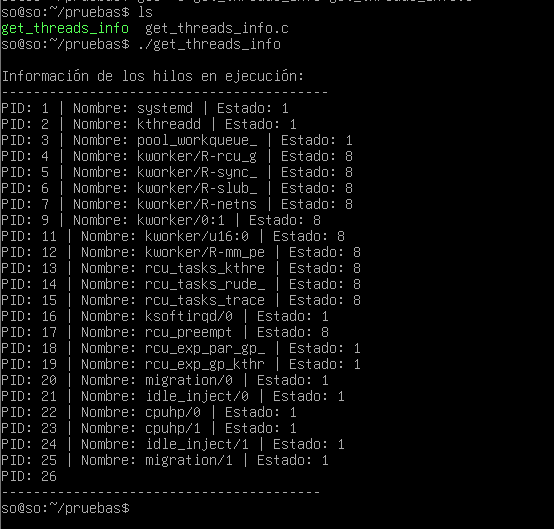
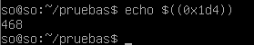

# SISTEMAS OPERATIVOS -  Práctica 2

## Requisitos    
Para realizar esta práctica puede utilizar exactamente la misma versión del código fuente de Linux utilizada en la práctica 1. Se puede usar la misma máquina virtual de la práctica 1 o una de su elección si resulta más cómodo (por ejemplo una VM con interfaz gráfica y un IDE).

## System Calls 

### Conceptos Generales

#### 1. ¿Qué es una System Call? ¿Para qué se utiliza?

> Es el **mecanismo fundamental que utiliza un proceso de usuario para solicitar un servicio al Sistema Operativo**. Actúa como una *interfaz controlada* o punto de entrada al kernel, permitiendo que un programa cruce la barrera de seguridad entre el Modo Usuario (restringido) y el Modo Kernel (privilegiado). Se utiliza para acceder a recursos protegidos y gestionar funciones que el proceso no puede realizar por sí solo debido a la falta de privilegios, tales como ***Gestión de Archivos, Control de Procesos, Gestión de Dispositivos y Comuncicaciones.***

#### 2. ¿Para qué sirve la macro syscall? Describa el propósito de cada uno de sus parámetros. Ayuda: http://www.gnu.org/software/libc/manual/html_mono/libc.html#System-Calls 

> La función o macro `syscall()` de la biblioteca libc permite invocar una llamada al sistema de manera explícita cuando no existe una función de envoltura (wrapper) específica en la librería.
> - ***Primer parámetro:*** Es el número identificador de la System Call (ej. SYS_get_threads_info).
> - ***Parámetros subsiguientes:*** Son los argumentos específicos que requiere la llamada (pueden ser hasta 6 en Linux). Estos pueden ser punteros a buffers, descriptores de archivos o tamaños de datos.

#### 3. Ejecute el siguiente comando e identifique el propósito de cada uno de los archivos que encuentra 
`ls -lh /boot | grep vmlinuz` 

> Aparecen las tres VM de Linux: vmlinux-6.1.0-29-amd64, vmlinux-6.1.0-31-amd64 y vmlinux-6.13.7

#### 4. Acceda al codigo fuente de GNU Linux, sea visitando https://kernel.org/ o bien trayendo el código del kernel(cuidado, como todo software monolítico son unos cuantos gigas) 

git clone https://github.com/torvalds/linux.git 

#### 5. ¿Para qué sirven el siguiente archivo? 
    a. arch/x86/entry/syscalls/syscall_64.tbl 

> Su función principal es establecer la correspondencia entre el número de la syscall y la función interna del kernel que debe ejecutarse. Tiene 4 columnas, `number`, `ABI` (interfaz binaria), `name` (nombre simbólico) y `entry point` (nombre de la función en C dentro del código)

#### 6. ¿Para qué sirve la herramienta strace? ¿Cómo se usa? 

>   `strace` es una herramienta de diagnóstico y depuración que permite interceptar y registrar las llamadas al sistema (syscalls) que ejecuta un proceso, junto con las señales que recibe. Muestra el nombre de la syscall, los argumentos que se le pasaron y el valor que devolvió el kernel.

#### 7. ¿Para qué sirve la herramienta ausyscall? ¿Cómo se usa? 

> `ausyscall` es una utilidad que forma parte del paquete de auditoría de Linux (auditd). Su función es actuar como un "traductor" entre los nombres de las syscalls y sus números correspondientes para una arquitectura específica. Sirve para verificar rápidamente qué número tiene asignado una syscall en el sistema o viceversa.

## Práctica guiada 

La System Calls que vamos a implementar accederán a la estructura task_struct que  representa cada proceso en el sistema. Ha evolucionado con el tiempo, pero en las versiones más recientes del kernel (6.x), sigue teniendo los mismos principios básicos con nuevas adiciones y 
modificaciones. Es la estructura utilizada por el scheduler para planificar las tareas del Sistema Operativo. 
Estas estructuras junto a otras conforman lo que en los libros de Sistemas Operativos se denomina la PCB (Process Control Block). 

### Agregamos una nueva System Call 
#### 1. Añadiremos el siguiente archivo con el código de nuestra system call:

kernel/my_sys_call.c 

    include <linux/kernel.h> 
    #include <linux/syscalls.h> 
    #include <linux/sched.h> 
    #include <linux/uaccess.h> 
    #include <linux/sched/signal.h> 
    #include <linux/slab.h>  // Para kmalloc y kfree

    SYSCALL_DEFINE1(my_sys_call, int, arg) { 
        printk(KERN_INFO "My syscall called with arg: %d\n", arg); 
        return 0; 
    }

    SYSCALL_DEFINE2(get_task_info, char __user *, buffer, size_t, length) { 
        struct task_struct *task; 
        char kbuffer[1024];  // Buffer en el espacio del kernel 
        int offset = 0; 
        
        for_each_process(task) { 
            offset += snprintf(kbuffer + offset, sizeof(kbuffer) - offset, 
            "PID: %d | Nombre: %s | Estado: %d \n",task->pid, task->comm, 
        task_state_index(task)); 
            if (offset >= sizeof(kbuffer))  // Evita sobrepasar el tamaño del 
        buffer 
                break; 
            
            printk(KERN_INFO "PID: %d | Nombre: %s\n", task->pid, task->comm);    
        } 
        
        // Copia la información al espacio de usuario 
        if (copy_to_user(buffer, kbuffer, min(length, (size_t)offset))) 
            return -EFAULT; 
        
        return min(length, (size_t)offset); 
    } 

    SYSCALL_DEFINE2(get_threads_info, char __user *, buffer, size_t, length) { 
    struct task_struct *task, *thread; 
    char *kbuffer; 
    int offset = 0; 
    
    // Asignar memoria dinámica para el buffer 
    kbuffer = kmalloc(2048, GFP_KERNEL); 
    if (!kbuffer) 
        return -ENOMEM; 
    
    for_each_process(task) { 
        offset += snprintf(kbuffer + offset, 2048 - offset, 
                            "Proceso: %s (PID: %d)\n", task->comm, task->pid); 
    
        for_each_thread(task, thread) { 
            offset += snprintf(kbuffer + offset, 2048 - offset,"    ├── Hilo: %s (TID: %d)\n", thread->comm, 
        thread->pid); 
                if (offset >= 2048) 
                    break; 
            } 
        
            if (offset >= 2048) 
                break; 
        } 
        
        if (copy_to_user(buffer, kbuffer, min(length, (size_t)offset))) { 
            kfree(kbuffer); 
            return -EFAULT; 
        } 
        
        kfree(kbuffer); 
        return min(length, (size_t)offset); 
        }

### Mirando el código anterior,  investigue y responda lo siguiente? 
#### ● ¿Para qué sirven los macros SYS_CALL_DEFINE? 
> Estas macros son la forma estándar y segura de definir una syscall en el kernel moderno. El número al final (SYSCALL_DEFINE**1**, SYSCALL_DEFINE**2**) indica cuántos argumentos recibe la función.

#### ● ¿Para que se utilizan la macros for_each_process y for_each_thread?
> - `for_each_process(task)`: Es un iterador que recorre la lista de todos los procesos activos en el sistema. En cada vuelta, la variable task apunta a la PCB del siguiente proceso.

> - `for_each_thread(task, thread)`: Una vez que estás parado en un proceso, esta macro recorre todos los hilos (threads) que pertenecen específicamente a ese proceso. Esto es porque en Linux, los hilos son tareas que comparten recursos con el proceso padre.

#### ● ¿Para que se utiliza la función copy_to_user? 
> `copy_to_user` copia de forma segura los datos generados hacia el puntero buffer que te pasó el usuario. Si el puntero del usuario es inválido o malintencionado, la función devuelve un error (-EFAULT) en lugar de romper el sistema.

#### ● ¿Para qué se utiliza la función printk?, ¿porque no la típica printf? 
> `printk` es la función de registro (logging) del kernel. Envía mensajes al buffer circular del sistema, los cuales podés ver después con el comando dmesg. `printf` pertenece a la biblioteca estándar de C (libc). El Kernel es un programa autónomo; no tiene librerías externas.

#### ● Podría explicar que hacen las sytem call que hemos incluido?

> - `my_sys_call(int arg)`: Es una syscall de prueba. Solo imprime un mensaje en el log del sistema confirmando que recibió el número que le pasaste. Sirve para verificar que la conexión usuario-kernel funciona.

> - `get_task_info(...)`: Recorre la lista de procesos (for_each_process) y guarda en un string el PID, el nombre y el estado de cada uno. Luego te "devuelve" esa lista al espacio de usuario para que puedas imprimirla en una terminal normal.

> - `get_threads_info(...)`: Es más detallada. No solo busca los procesos, sino que por cada proceso entra a ver sus hilos hijos (for_each_thread) y arma un "arbolito" visual con los nombres y TIDs de cada hilo.

## Monitoreando System Calls 
### 1. Ejecute el programa anteriormente compilado 
`$ ./get_threads_info` 

#### Cual es el output del programa? 

### 2. Luego de ejecutar el programa ahora ejecute 
`$ sudo dmesg` 
#### ¿Cuál es el output? porque?(recuerde printk y lea el man de dmesg) 

    El output son los mensajes del Kernel Ring Buffer. Muestra la inicialización de módulos, detección de hardware y, fundamentalmente, los mensajes generados por las funciones printk dentro de las System Calls ejecutadas.

### 3. Ejecute el programa anteriormente compilado con la herramienta strace 
`$ strace get_threads_info` 
 
 Aclaración: Si el programa strace no está instalado, puede instalarlo en distribuciones basadas en Debian con: 
 $ sudo apt-get install strace 

Si luego ejecuto 
`echo $((0x1d4))`

####  ¿Qué valor obtengo? porque?  

> Porque 0x1d4 es la representación en hexadecimal del número decimal 468. El comando `echo $((...))` en Bash realiza una conversión automática a base 10.

## Módulos y Drivers 

### Conceptos generales 
### 1. ¿Cómo se denomina en GNU/Linux a la porción de código que se agrega al kernel en tiempo de ejecución? ¿Es necesario reiniciar el sistema al cargarlo? Si no se pudiera utilizar esto. ¿Cómo deberíamos hacer para proveer la misma funcionalidad en Gnu/Linux?
> Se denominan **LKM (Linux Kernel Modules)** o simplemente módulos. No es necesario reiniciar. Esa es su gran ventaja, se cargan y descargan en caliente (insmod/rmmod). Deberíamos incluir el código directamente en el código fuente del Kernel y recompilar todo el núcleo cada vez que queramos agregar algo.
### 2. ¿Qué es un driver? ¿Para qué se utiliza? 
> Es un componente de software específico que permite al SO comunicarse con un hardware determinado. Actúa como un "traductor" entre las llamadas genéricas del OS y los comandos específicos del dispositivo.
### 3. ¿Por qué es necesario escribir drivers?
> Porque el Kernel no puede conocer de antemano el protocolo de comunicación de cada mouse, placa de video o sensor que se invente. El driver abstrae esa complejidad.
### 4. ¿Cuál es la relación entre módulo y driver en GNU/Linux?
> Un ***módulo*** es el formato de archivo, un ***driver*** es la función que cumple ese código. Casi todos los drivers en Linux se distribuyen como módulos, pero no todos los módulos son drivers (algunos pueden ser sistemas de archivos o protocolos de red).
### 5. ¿Qué implicancias puede tener un bug en un driver o módulo?
> Como corren en Espacio de Kernel (Privilegio máximo), un error no solo cierra el programa, sino que puede provocar un Kernel Panic, congelar el sistema o corromper datos, ya que tienen acceso directo a la memoria.
### 6. ¿Qué tipos de drivers existen en GNU/Linux?
 > - **Caracter (char)**: Procesan datos byte a byte (ej: teclado, puerto serie).

> - ***Bloque (block)***: Procesan datos en bloques de tamaño fijo (ej: discos rígidos, SSDs).

> - ***Red (network)***: Gestionan el envío/recepción de paquetes de red.
### 7. ¿Qué hay en el directorio /dev? ¿Qué tipos de archivo encontramos en esa ubicación? 
> Contiene *archivos de dispositivo*. En Linux, "todo es un archivo". En esta ubicación no hay datos reales, sino "puertas de acceso" al hardware. Encontramos archivos de tipo c (carácter) y b (bloque).
### 8. ¿Para qué sirven el archivo `/lib/modules/<version>/modules.dep` utilizado por el comando modprobe? 
>Es una base de datos de dependencias. Le sirve a `modprobe` para saber que si querés cargar el "Módulo A", primero debe cargar automáticamente el "Módulo B" porque el A lo necesita para funcionar.
### 9. ¿En qué momento/s se genera o actualiza un initramfs? 
> Se genera o actualiza al instalar un nuevo Kernel o al usar el comando update-initramfs. Sirve para cargar un sistema de archivos temporal en RAM antes de que el disco real esté montado.
### 10. ¿Qué módulos y drivers deberá tener un initramfs mínimamente para cumplir su objetivo? 
> Debe tener los drivers del controlador de disco (SATA, SCSI, NVMe) y del sistema de archivos (ext4, xfs) donde reside la partición raíz (/), de lo contrario el Kernel no podrá seguir arrancando.

### Práctica guiada 

### El objetivo de este ejercicio es crear un módulo sencillo y poder cargarlo en nuestro kernel con el fin de consultar que el mismo se haya registrado correctamente. 

### 1. Crear el archivo memory.c con el siguiente código (puede estar en cualquier directorio,  incluso fuera del directorio del kernel): 
    #include <linux/module.h> 
    MODULE_LICENSE("Dual BSD/GPL"); 

### 2. Crear el archivo Makefile con el siguiente contenido: 
    obj-m := memory.o 
#### Responda lo siguiente: 
#### a. Explique brevemente cual es la utilidad del archivo Makefile. 
> En el desarrollo de módulos, el Makefile no solo compila el código, sino que le indica al Kbuild (el sistema de construcción del Kernel) qué objeto debe generar (memory.o) para luego transformarlo en un módulo cargable (memory.ko). Sin él, el Kernel no sabría cómo enlazar tu código con sus propias funciones internas.
#### b. ¿Para qué sirve la macro MODULE_LICENSE? ¿Es obligatoria? 
> Técnicamente el módulo puede compilar sin ella, pero al cargarlo el Kernel mostrará un mensaje de advertencia diciendo que el núcleo está "tainted" (contaminado). Sirve para que el Kernel sepa que tu código es compatible con la licencia GPL. Si no la ponés, muchas funciones avanzadas del Kernel (marcadas como GPL_ONLY) no estarán disponibles para tu módulo.

### 3. Ahora es necesario compilar nuestro módulo usando el mismo kernel en que correrá el mismo, utilizaremos el que instalamos en el primer paso del ejercicio guiado. 
    $ make -C <KERNEL_CODE> M=$(pwd) modules

### Responda lo siguiente: 
#### a. ¿Cuál es la salida del comando anterior? 
> La salida muestra el proceso de construcción del kernel (Kbuild) entrando en los directorios del núcleo y de tu módulo, ejecutando el compilador (CC) para generar memory.o, procesando los símbolos (MODPOST) y finalmente vinculando el objeto del kernel (LD) para crear memory.ko.
#### b. ¿Qué tipos de archivo se generan? Explique para qué sirve cada uno. 
> -  **memory.o:** El archivo objeto resultante de la compilación de tu código C.

> - **memory.mod.o / .mod.c:** Archivos auxiliares que contienen metadatos sobre el módulo (como la licencia y versión).

> - **memory.ko (Kernel Object):** Es el archivo definitivo. Es un binario que el kernel puede cargar dinámicamente en memoria para extender su funcionalidad.

> - **modules.order / Module.symvers:** Listas internas que usa el kernel para gestionar el orden de carga y las versiones de los símbolos.
#### c. Con lo visto en la Práctica 1 sobre Makefiles, construya un Makefile de manera que si ejecuto  
    i. make, nuestro módulo se compila
    ii. make clean, limpia el módulo y el código objeto generado
    iii. make run, ejecuta el programa

#### 4. El paso que resta es agregar y eventualmente quitar nuestro módulo al kernel en tiempo de ejecución.  Ejecutamos: 
`insmod memory.ko` 
a. Responda lo siguiente: 
b. ¿Para qué sirven el comando insmod y el comando modprobe? ¿En qué se 
diferencian? 
> `insmod:` Es una herramienta simple que carga el archivo .ko que le indiques por ruta. No entiende de dependencias; si tu módulo necesita otro para funcionar, insmod fallará.

> `modprobe:` Es más inteligente. Busca módulos en /lib/modules/ y consulta el archivo modules.dep. Si el módulo que querés cargar depende de otros, modprobe los carga automáticamente en el orden correcto.

#### 5. Ahora ejecutamos: 
    $ lsmod | grep memory 
#### Responda lo siguiente: 
#### a. ¿Cuál es la salida del comando? Explique cuál es la utilidad del comando lsmod. 
    memory      12288  0
> El comando `lsmod` sirve para listar todos los módulos del kernel que se encuentran cargados actualmente en la memoria RAM. Muestra el nombre del módulo, su tamaño en bytes y un contador que indica cuántas instancias o procesos lo están utilizando en ese momento.

#### b. ¿Qué información encuentra en el archivo /proc/modules? 
> Este es un archivo virtual que contiene el estado en tiempo real de todos los módulos cargados.
#### c. Si ejecutamos more /proc/modules encontramos los siguientes fragmentos ¿Qué información obtenemos de aquí?: 
    memory 8192 0 - Live 0x0000000000000000 (OE) 
    binfmt_misc 24576 1 - Live 0x0000000000000000 
    intel_rapl_msr 16384 0 - Live 0x0000000000000000 
    intel_rapl_common 32768 1 intel_rapl_msr, Live 0x0000000000000000

> - ***memory 8192 0 - Live 0x... (OE):*** Indica que el módulo memory ocupa 8192 bytes, no tiene procesos usándolo (0), su estado es Live (activo) y las siglas (OE) significan Out-of-tree (externo) y External license, lo que indica que no es parte del código fuente oficial de Linux.

> - ***intel_rapl_common 32768 1 intel_rapl_msr:*** Acá el 1 y el nombre al final indican una dependencia: este módulo está siendo utilizado por intel_rapl_msr, por lo que no se podría descargarlo sin quitar primero el otro.

#### d. ¿Con qué comando descargamos el módulo de la memoria? 
  
> Se utiliza el comando `rmmod` seguido del nombre del módulo (en este caso: sudo /sbin/rmmod memory).

#### 8. Responda lo siguiente: 
#### a. ¿Para qué sirven las funciones module_init y module_exit?. ¿Cómo haría para ver la información del log que arrojan las mismas?. 
> - `module_init`: Es la macro que define el "punto de entrada" del módulo. Sirve para registrar la función que el kernel debe ejecutar al momento de cargar el módulo (mediante insmod), donde generalmente se reservan recursos, se inicializa el hardware o se registra el dispositivo (como hicimos con el Major 60).

> - `module_exit:` Define la función de salida que se ejecuta al descargar el módulo (mediante rmmod). Su función principal es la "limpieza": debe liberar todos los recursos, desregistrar dispositivos y devolver la memoria utilizada para evitar fugas en el kernel.

> Para ver la información que arrojan (los mensajes de printk), se utiliza el comando dmesg. Este comando imprime el buffer de mensajes del kernel donde quedan registrados los eventos de carga y descarga, como vimos en tus pruebas.

#### b. Hasta aquí hemos desarrollado, compilado, cargado y descargado un módulo en nuestro kernel. En este punto y sin mirar lo que sigue. ¿Qué nos falta para tener un driver completo?. 

> Aunque el módulo ya vive en el kernel y tiene un Major Number asignado, para que sea un "driver" funcional todavía nos falta:

> - **El Nodo de Dispositivo:** Crear un archivo especial en /dev (usando mknod) que actúe como interfaz entre el usuario y el driver. Sin este archivo, los programas no tienen "ruta" para comunicarse con el código que cargamos.

> - **Lógica de E/S:** Implementar el cuerpo de las funciones read y write. Hasta ahora las dejamos vacías; falta que el driver realmente guarde datos en un buffer y los entregue cuando se soliciten.

#### c. Clasifique los tipos de dispositivos en Linux. Explique las características de cada uno. 

> - **Dispositivos de Caracteres (Character Devices):**
>   - Se accede a ellos como un flujo de bytes secuenciales (como un teclado o un puerto serie).
>   - No permiten el acceso aleatorio (no podés saltar a cualquier posición fácilmente) y generalmente no usan buffers del sistema.

> - **Dispositivos de Bloque (Block Devices):**
>   - Manejan datos en trozos de tamaño fijo llamados bloques (como discos rígidos o SSDs).
>   - Soportan acceso aleatorio (podés leer el bloque 100 sin leer los anteriores) y aprovechan el cache del sistema para mayor velocidad.

> - **Interfaces de Red (Network Interfaces):**
>   - A diferencia de los otros dos, no aparecen como archivos en /dev.
>   - Se encargan de enviar y recibir paquetes de datos a través de protocolos y se gestionan con herramientas específicas de red.

  