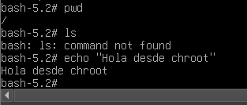

# SISTEMAS OPERATIVOS -  Práctica 4A - cgroups & namespaces 

## Requisitos 
A partir de esta práctica no se debe utilizar el kernel compilado en las prácticas anteriores ya 
que le faltan varios módulos necesarios para distintas funcionalidades. Usá algún kernel 
completo como el kernel de Debian que viene originalmente en la VM de la práctica. 

## Parte 1: Conceptos teóricos 

### 1. Defina virtualización. Investigue cuál fue la primera implementación que se realizó. 
>  Es una manera de formar una abrstracción sobre el Hardware para obtener una mejor utilización de los recursos y flexibilidad. La primera implementación significativa de virtualización fue realizada por IBM en la década de 1960.

### 2. ¿Qué diferencia existe entre virtualización y emulación? 
> La diferencia fundamental entre virtualización y emulación reside en cómo interactúan con el hardware físico y si el sistema operativo invitado puede "hablar" directamente con él o necesita un intérprete.

Característica | Virtualización | Emulación |
 :--- | :---: | :---: |
Arquitectura| Debe ser la misma que el host | Puede ser totalmente diferente 
Ejecución | Directa en el hardware (en su mayoría) | Siempre traducida por software 
Rendimiento | Alta eficiencia (casi nativa) | Baja eficiencia (mucha sobrecarga) 
Objetivo| Compartir y optimizar recursos físicos | Simular un hardware que no existe físicamente

### 3. Investigue el concepto de hypervisor y responda: 
#### (a) ¿Qué es un hypervisor? 
> Es una porción de software que separa las "aplicaciones/SO" del harware subyacente.
#### (b) ¿Qué beneficios traen los hypervisors? ¿Cómo se clasifican?
> Los beneficios principales son: un mejor aporvechamiento del HW, aislamiento entre sistemas y la portabilidad. Se clasifican en **Tipo 1** y **Tipo 2**, el primero se ejecuta en modo Kernel y el segundo como un programa de usuario en un SO root. 

### 4. ¿Qué es la full virtualization? ¿Y la virtualización asistida por hardware?
> Se trata de particionar un procesador físico en distintos contextos, donde cada uno de ellos corre sobre el mismo procesador. La **virtualización asistida por hardware** utiliza extensiones del procesador para mejorar el rendimiento y permitir que el hypervisor delegue operaciones críticas directamente al hardware, eliminando la sobrecarga de emulación.
### 5. ¿Qué implica la técnica binary translation? ¿Y trap-and-emulate?
> En **Bynary translation**, el hypervisor traduce dinámicamente las instrucciones privilegiadas del guest OS a instrucciones seguras para ejecutar en modo usuario. **Trap and emulate** hace que el hypervisor capture las instrucciones privilegiadas y luego las emule en modo kernel, es más eficiente pero requiere soporte HW.

### 6. Investigue el concepto de paravirtualización y responda: 
#### (a) ¿Qué es la paravirtualización? 
> Es una técnica de virtulización donde el guest OS se modifica para interactuar directamente con el hypervisor mediante API´s optimizadas, evita la emulación completa de HW y la traducción binaria, además, reduce la sobrecarga.
#### (b) Mencione algún sistema que implemente paravirtualización.
>  Algunos de los sistemas que utilizan paravirtualización son: ***Xen, KVM (Kernel-based Virtual Machine), Hyper-V (antes conocido como Viridian) y VMI Linux (VMIL)***
#### (c) ¿Qué beneficios trae con respecto al resto de los modos de virtualización? 
> Mejora significativa del rendimiento, Eficiencia en la gestión de recursos críticos, Reducción de la complejidad del Hipervisor y Menor impacto en la arquitectura de la CPU.

### 7. Investigue sobre containers y responda: 
#### (a) ¿Qué son? 
> Es una técnica liviana de virtualización a nivel SO. Permite ejecutar múltiples sistemas aislados en un único host. 
#### (b) ¿Dependen del hardware subyacente?
> No directamente. Una de las mayores ventajas de los contenedores es la abstracción del hardware. El contenedor interactúa con el Kernel del SO, y es el Kernel el que se encarga de hablar con el hardware (CPU, RAM, Disco).

#### (c) ¿Qué lo diferencia por sobre el resto de las tecnologías estudiadas? 
> La diferencia principal es el nivel de aislamiento:
> - ***Virtualización de Hardware (VMs):*** Emula el hardware completo. Cada VM tiene su propio Kernel, memoria reservada y drivers. Es pesado (GBs) y tarda minutos en arrancar.

> - ***Virtualización a nivel de SO (Containers):*** Comparten el mismo Kernel del host. No hay emulación de hardware.
>   - *Ligereza:* Pesan MBs en lugar de GBs.
>   - *Velocidad:* Arrancan en milisegundos (es como lanzar un proceso).
>   - *Eficiencia:* No desperdician RAM ejecutando 10 kernels distintos para 10 aplicaciones.
#### (d) Investigue qué funcionalidades son necesarias para poder implementar containers. 

> Para que un sistema operativo (como Linux) pueda crear contenedores, necesita "engañar" a los procesos para que crean que están solos en la máquina. Esto se logra principalmente con dos funcionalidades del Kernel:
> - ***Namespaces (Aislamiento):*** Es lo que permite que un proceso vea solo "su parte" del sistema. Hay namespaces para:
>   - ***PID:*** El contenedor cree que su proceso es el #1.
>   - ***Network:*** Tiene su propia IP y puertos.
>   - ***Mount:*** Tiene su propio sistema de archivos.

> - ***Control Groups (cgroups - Limitación):*** Es lo que evita que un contenedor ruidoso use toda la CPU o RAM de la PC. Permite ponerle un tope (ej: "este contenedor solo puede usar 512MB de RAM").

> - ***Union File Systems (Capas):*** Permite construir imágenes por capas, compartiendo archivos comunes entre distintos contenedores para ahorrar espacio en disco.

## Parte 2: chroot, Control Groups y Namespaces 
### Debido a que para la realización de la práctica es necesario tener más de una terminal 
abierta simultáneamente tenga en cuenta la posibilidad de lograr esto mediante alguna 
alternativa (ssh, terminales gráficas, etc.) 

### Chroot 
#### En algunos casos suele ser conveniente restringir la cantidad de información a la que un proceso puede acceder. Uno de los métodos más simples para aislar servicios es chroot, que consiste simplemente en cambiar lo que un proceso, junto con sus hijos, consideran que es el directorio raíz, limitando de esta forma lo que pueden ver en el sistema de archivos. En esta sección de la práctica se preparará un árbol de directorios que sirva como directorio raíz para la ejecución de una shell. 

### 1. ¿Qué es el comando chroot? ¿Cuál es su finalidad? 

> Es una operación que cambia el directorio raíz aparente para el proceso que se está ejecutando actualmente y sus procesos hijos. Se utiliza para ***aislar procesos sospechosos o servicios de red*** (como un servidor FTP) para que, si los hackean, el atacante no tenga acceso a todo el sistema, también para ***correr software en un entorno limpio*** sin ensuciar el sistema principal.

### 2. Crear un subdirectorio llamado sobash dentro del directorio root. Intente ejecutar el comando chroot /root/sobash. ¿Cuál es el resultado? ¿Por qué se obtiene ese resultado?

> `chroot: failed to run command ‘/bin/sh’: No such file or directory.` Porque la carpeta sobash está vacía. No tiene ni el programa bash ni las librerías para arrancar.

> Resultado obtenido luego de crear la jaula:

## A continuación se probará el uso de cgroups. Para eso se crearán dos procesos que compartirán una misma CPU y cada uno la tendrá asignada un tiempo determinado. Nota: es posible que para ejecutar xterm tenga que instalar un gestor de ventanas. Esto puede hacer con apt-get install xterm. 
 
###  1. ¿Dónde se encuentran montados los cgroups? ¿Qué versiones están disponibles? 
> Se encuentran en /sys/fs/cgroup/. Es un sistema de archivos de tipo tmpfs que sirve como interfaz al kernel. Están disponibles v1 (jerarquías separadas por recurso) y v2 (jerarquía unificada). Con el cambio que hiciste en el GRUB (systemd.unified_cgroup_hierarchy=0), estás forzando el uso predominante de v1.

###  2. ¿Existe algún controlador disponible en cgroups v2? ¿Cómo puede determinarlo?
> No se pueden montar controladores individualmente. Se utiliza `cgroups`, es una lista de controladores disponible.

###  3. Analice qué sucede si se remueve un controlador de cgroups v1 (por ej. Umount /sys/fs/cgroup/rdma). 
> Si se hace umount `/sys/fs/cgroup/rdma`, se desmonta la interfaz de usuario para ese recurso. El kernel sigue gestionando RDMA, pero ya no tenés los archivos de control para limitar o monitorear procesos desde esa carpeta. Es como sacar el volante de un auto; el motor sigue ahí, pero no podés dirigirlo.

### 4. Crear dos cgroups dentro del subsistema cpu llamados cpualta y cpubaja. Controlar que se hayan creado tales directorios y ver si tienen algún contenido # mkdir /sys/fs/cgroup/cpu/"nombre_cgroup" 
### 5. En base a lo realizado, ¿qué versión de cgroup se está utilizando? 
### 6. Indicar a cada uno de los cgroups creados en el paso anterior el porcentaje máximo de CPU que cada uno puede utilizar. El valor de cpu.shares en cada cgroup es 1024. El cgroupcpualta recibirá el 70 % de CPU y cpubaja el 30 %. 
# echo 717 > /sys/fs/cgroup/cpu/cpualta/cpu.shares 
# echo 307 > /sys/fs/cgroup/cpu/cpubaja/cpu.shares

> El kernel crea automáticamente archivos de interfaz (como cpu.shares, cpu.stat, etc.) porque /sys/fs/cgroup no es un disco rígido normal, sino un sistema de archivos virtual que se comunica directo con el kernel.

###  7. Iniciar dos sesiones por ssh a la VM.(Se necesitan dos terminales, por lo cual, también podría ser realizado con dos terminales en un entorno gráfico). Referenciaremos a unaterminal como termalta y a la otra, termbaja. 
  
  
### 8. Usando el comando taskset, que permite ligar un proceso a un core en particular, se iniciará el siguiente proceso en background. Uno en cada terminal. Observar el PID asignado al proceso que es el valor de la columna 2 de la salida del comando. 
    taskset -c 0 md5sum /dev/urandom & 
  
  
### 9. Observar el uso de la CPU por cada uno de los procesos generados (con el comando top en otra terminal). ¿Qué porcentaje de CPU obtiene cada uno aproximadamente? 

### 10. En cada una de las terminales agregar el proceso generado en el paso anterior a uno de los cgroup (termalta agregarla en el cgroup cpualta, termbaja en cpubaja. El process_pid es el que obtuvieron después de ejecutar el comando taskset) 
# echo "process_pid" > /sys/fs/cgroup/cpu/cpualta/cgroup.procs 

### 11. Desde otra terminal observar cómo se comporta el uso de la CPU. ¿Qué porcentaje de CPU recibe cada uno de los procesos? 

### 12. En termalta, eliminar el job creado (con el comando jobs ven los trabajos, con kill %1 lo eliminan. No se olviden del %.). ¿Qué sucede con el uso de la CPU? 

### 13. Finalizar el otro proceso md5sum. 

### 14. En este paso se agregarán a los cgroups creados los PIDs de las terminales (Importante: si se tienen que agregar los PID desde afuera de la terminal ejecute el comando echo $$ dentro de la terminal para conocer el PID a agregar. Se debe agregar el PID del shell ejecutando en la terminal). 
    # echo $$ > /sys/fs/cgroup/cpu/cpualta/cgroup.procs (termalta) 
    # echo $$ > /sys/fs/cgroup/cpu/cpubaja/cgroup.procs (termbaja) 

### 15. Ejecutar nuevamente el comando taskset -c 0 md5sum /dev/urandom & en cada una de las terminales. ¿Qué sucede con el uso de la CPU? ¿Por qué? 